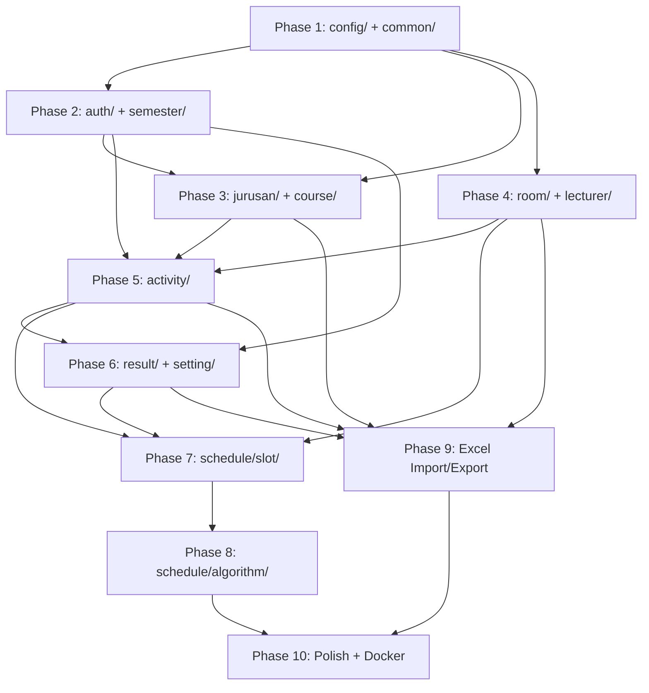

# Execution Roadmap: Timetabling Backend — Laravel → Spring Boot Migration

> **Document Version:** 2.0
> **Date:** 2026-07-11
> **Reference Spec:** [backend-spec.md](file:///c:/Users/Asus/Documents/Kuliah/Materi/Sem%208/Penelitian%20Ko%20Ray/Code/backend-spec.md)
> **Architecture:** Package by Feature (Domain-Driven Design)
> **Status:** Approved — Ready for Phase 1 execution.

---

## Table of Contents

1. [Overview](#1-overview)
2. [Resolved Decisions](#2-resolved-decisions)
3. [Phase 1 — Project Initialization & Global Configuration](#phase-1--project-initialization--global-configuration)
4. [Phase 2 — Core Domain: auth/ and semester/](#phase-2--core-domain-auth-and-semester)
5. [Phase 3 — Academic Domain: jurusan/ and course/](#phase-3--academic-domain-jurusan-and-course)
6. [Phase 4 — Resource Domain: room/ and lecturer/](#phase-4--resource-domain-room-and-lecturer)
7. [Phase 5 — Scheduling Domain: activity/](#phase-5--scheduling-domain-activity)
8. [Phase 6 — Results & Settings: result/ and setting/](#phase-6--results--settings-result-and-setting)
9. [Phase 7 — Slot Validation Engine: schedule/slot/](#phase-7--slot-validation-engine-scheduleslot)
10. [Phase 8 — Genetic Algorithm & Timetable: schedule/algorithm/](#phase-8--genetic-algorithm--timetable-schedulealgorithm)
11. [Phase 9 — Excel Import/Export](#phase-9--excel-importexport)
12. [Phase 10 — Polish, Testing & Docker](#phase-10--polish-testing--docker)
13. [File Count Summary](#file-count-summary)

---

## 1. Overview

| Item | Value |
|------|-------|
| **Target directory** | `Code/new/timetabling-backend/` |
| **Legacy reference (read-only)** | `timetabling_laravel/` |
| **Partial rewrite reference (read-only)** | `timetabling_laravel/genetic/timetablingapp/` |
| **Build tool** | Gradle (Kotlin DSL) |
| **Framework** | Spring Boot 4.0.2 |
| **Java version** | 21 |
| **Root package** | `com.timetablingapp` |
| **Architecture** | Package by Feature (DDD) |
| **Database** | Existing Laravel MySQL database (`ddl-auto=validate`) |
| **Estimated total files** | ~165 |
| **Estimated phases** | 10 |

---

## 2. Resolved Decisions

All open questions from v1.0 have been resolved:

| Question | Decision | Rationale |
|----------|----------|-----------|
| **Q1: Build Tool** | **Gradle (Kotlin DSL)** | Matches the `genetic/` rewrite |
| **Q2: Package Name** | **`com.timetablingapp`** | Exact match with `genetic/` rewrite |
| **Q3: Spring Boot Version** | **4.0.2** | From `genetic/build.gradle.kts` |
| **Q4: Java Version** | **21** | From `genetic/build.gradle.kts` toolchain |
| **Q5: Database Strategy** | **Option A** — Connect to existing Laravel DB | `ddl-auto=validate`, no Flyway initially |
| **Architecture** | **Package by Feature (DDD)** | Each domain is a self-contained package |

---

## Phase 1 — Project Initialization & Global Configuration

**Goal:** A bootable Spring Boot 4.0.2 app with security, CORS, error handling, and base abstractions. `./gradlew bootRun` starts cleanly and Swagger UI is accessible.

### Files to Generate (22 files)

```
new/timetabling-backend/
├── build.gradle.kts
├── settings.gradle.kts
├── src/main/java/com/timetablingapp/
│   ├── TimetablingappApplication.java
│   │
│   ├── config/
│   │   ├── SecurityConfig.java
│   │   ├── JwtAuthenticationFilter.java
│   │   ├── JwtService.java
│   │   ├── CorsConfig.java
│   │   ├── OpenApiConfig.java
│   │   ├── JpaAuditingConfig.java
│   │   └── GAConfig.java
│   │
│   └── common/
│       ├── base/
│       │   ├── BaseEntity.java
│       │   ├── BaseSoftDeleteEntity.java
│       │   ├── BaseCrudService.java
│       │   └── BaseCrudController.java
│       ├── dto/
│       │   ├── MessageResponse.java
│       │   └── ImportResultResponse.java
│       └── exception/
│           ├── GlobalExceptionHandler.java
│           ├── ResourceNotFoundException.java
│           ├── DuplicateResourceException.java
│           ├── BadRequestException.java
│           └── ErrorResponse.java
├── src/main/resources/
│   ├── application.properties
│   └── application-dev.properties
└── src/test/java/com/timetablingapp/
    └── TimetablingappApplicationTests.java
```

### File Descriptions

| File | Purpose |
|------|---------|
| `build.gradle.kts` | Spring Boot 4.0.2, Java 21 toolchain, all dependencies from spec §1 |
| `settings.gradle.kts` | `rootProject.name = "timetablingapp"` |
| `TimetablingappApplication.java` | `@SpringBootApplication` main class |
| `SecurityConfig.java` | Stateless JWT filter chain, public endpoints (`/api/auth/login`, Swagger), `@EnableMethodSecurity` |
| `JwtAuthenticationFilter.java` | `OncePerRequestFilter` — extract/validate JWT from `Authorization: Bearer` header |
| `JwtService.java` | Token generation (HS256), validation, claim extraction |
| `CorsConfig.java` | Configurable frontend origins |
| `OpenApiConfig.java` | Swagger UI metadata + JWT bearer auth scheme |
| `JpaAuditingConfig.java` | `@EnableJpaAuditing` for `@CreatedDate` / `@LastModifiedDate` |
| `GAConfig.java` | `@ConfigurationProperties(prefix = "ga")` — populationSize, generations, crossoverRate, mutationRate |
| `BaseEntity.java` | `@MappedSuperclass` with `createdAt`, `updatedAt` |
| `BaseSoftDeleteEntity.java` | Extends `BaseEntity`, adds `deletedAt` |
| `BaseCrudService.java` | Generic interface: `create`, `findAll`, `findById`, `update`, `delete` |
| `BaseCrudController.java` | Abstract generic REST controller with 5 CRUD endpoint methods |
| `MessageResponse.java` | `{ success, message, timestamp }` |
| `ImportResultResponse.java` | `{ success, message, importedCount, errors }` |
| `GlobalExceptionHandler.java` | `@RestControllerAdvice` with all 10 exception handlers from spec §5.3 |
| `ResourceNotFoundException.java` | 404 with `resourceName`, `fieldName`, `fieldValue` |
| `DuplicateResourceException.java` | 409 for unique constraint violations |
| `BadRequestException.java` | 400 for business rule violations |
| `ErrorResponse.java` | Standard JSON error body: `success`, `status`, `error`, `message`, `path`, `timestamp`, `fieldErrors` |
| `application.properties` | Datasource to existing Laravel DB, `ddl-auto=validate`, JWT secret, GA defaults |
| `application-dev.properties` | `show-sql=true`, local overrides |

### Verification Criteria

- [ ] `./gradlew clean build` passes with zero errors
- [ ] `./gradlew bootRun` starts the application on configured port
- [ ] Swagger UI is accessible at `/swagger-ui.html`
- [ ] Any unknown endpoint returns the standardized `ErrorResponse` JSON

---

## Phase 2 — Core Domain: `auth/` and `semester/`

**Goal:** Working JWT authentication + user management + semester management. Login flow is functional end-to-end.

### Files to Generate (19 files)

```
src/main/java/com/timetablingapp/
├── auth/
│   ├── User.java                        # @Entity
│   ├── UserRole.java                    # enum: ADMIN, FACULTY_USER
│   ├── UserRepository.java
│   ├── AuthController.java             # POST /api/auth/login, logout, me
│   ├── AuthService.java
│   ├── LoginRequest.java
│   ├── AuthResponse.java
│   ├── UserController.java             # CRUD /api/users
│   ├── UserService.java
│   ├── CreateUserRequest.java
│   ├── UpdateUserRequest.java
│   └── UserResponse.java
│
└── semester/
    ├── Semester.java                    # @Entity (soft delete)
    ├── SemesterRepository.java
    ├── SemesterController.java          # CRUD + next/duplicate/current
    ├── SemesterService.java
    ├── SemesterRequest.java
    ├── SetCurrentSemesterRequest.java
    └── SemesterResponse.java
```

### Key Business Logic

| Feature | Logic |
|---------|-------|
| `POST /api/auth/login` | Validate email+password → generate JWT → return `AuthResponse` |
| `GET /api/auth/me` | Return `UserResponse` from `SecurityContext` |
| `User.isAdmin()` | `@Transient`: returns `true` if `faculty == null \|\| faculty.isBlank()` |
| `POST /api/semesters/next` | Create new semester with incremented academic year |
| `POST /api/semesters/duplicate` | Clone activities and constraints from current semester |
| `PUT /api/semesters/current` | Toggle `current` flag (unset previous, set new) |

### Verification Criteria

- [ ] `POST /api/auth/login` returns a valid JWT
- [ ] `GET /api/auth/me` with Bearer token returns user info
- [ ] Protected endpoints return 401 without token
- [ ] User CRUD works (ADMIN only)
- [ ] Semester CRUD + `next`/`duplicate`/`current` operations work
- [ ] `ddl-auto=validate` succeeds against existing `users` and `semesters` tables

---

## Phase 3 — Academic Domain: `jurusan/` and `course/`

**Goal:** Department and course management with concentrations and course constraints.

### Files to Generate (17 files)

```
src/main/java/com/timetablingapp/
├── jurusan/
│   ├── Jurusan.java                     # @Entity (soft delete)
│   ├── Jenjang.java                     # enum: D3, S1, S2, S3
│   ├── JurusanRepository.java
│   ├── JurusanController.java           # CRUD + GET /{id}/konsentrasi
│   ├── JurusanService.java
│   ├── JurusanRequest.java
│   ├── JurusanResponse.java
│   └── konsentrasi/
│       ├── Konsentrasi.java             # @Entity (soft delete)
│       ├── KonsentrasiRepository.java
│       └── KonsentrasiResponse.java
│
└── course/
    ├── Course.java                      # @Entity (soft delete), unique `code`
    ├── CourseType.java                  # enum: WAJIB, PILIHAN
    ├── CourseRepository.java
    ├── CourseController.java            # CRUD + /info, /by-jurusan
    ├── CourseService.java
    ├── CourseRequest.java
    ├── CourseResponse.java
    ├── CourseInfoResponse.java
    └── constraint/
        ├── CourseConstraint.java        # @Entity (no soft delete)
        └── CourseConstraintRepository.java
```

### Key Business Logic

| Feature | Logic |
|---------|-------|
| `GET /api/jurusans/{id}/konsentrasi` | Query `KonsentrasiRepository.findByJurusanId(id)` |
| `GET /api/courses/by-jurusan/{id}` | Query `CourseRepository.findByJurusanId(id)` |
| `GET /api/courses/{id}/info` | Return course with its activity summary |
| `CourseResponse.color` | Computed HSL string from `jurusan.color` |
| Faculty filtering | `JurusanService` filters by `faculty` for non-admin users |

### Verification Criteria

- [ ] Jurusan CRUD works, including the konsentrasi sub-resource
- [ ] Course CRUD works with jurusan relationship
- [ ] `ddl-auto=validate` succeeds against `jurusans`, `konsentrasi`, `courses`, `course_constraints`
- [ ] Faculty-based filtering works: non-admin only sees their faculty's jurusans

---

## Phase 4 — Resource Domain: `room/` and `lecturer/`

**Goal:** Room and lecturer management with availability/priority time slots.

### Files to Generate (25 files)

```
src/main/java/com/timetablingapp/
├── room/
│   ├── Room.java                        # @Entity (soft delete, self-referential parent)
│   ├── RoomRepository.java
│   ├── RoomController.java             # CRUD
│   ├── RoomService.java
│   ├── RoomRequest.java
│   ├── RoomResponse.java
│   ├── type/
│   │   ├── RoomType.java               # @Entity (soft delete)
│   │   ├── RoomTypeRepository.java
│   │   ├── RoomTypeController.java     # CRUD
│   │   ├── RoomTypeService.java
│   │   ├── RoomTypeRequest.java
│   │   └── RoomTypeResponse.java
│   └── available/
│       ├── RoomAvailable.java          # @Entity (soft delete)
│       ├── RoomAvailableRepository.java
│       ├── RoomAvailableController.java # CRUD
│       ├── RoomAvailableService.java
│       ├── RoomAvailableRequest.java
│       └── RoomAvailableResponse.java
│
└── lecturer/
    ├── Lecturer.java                    # @Entity (soft delete), unique `nik`
    ├── LecturerRepository.java
    ├── LecturerController.java          # CRUD
    ├── LecturerService.java
    ├── LecturerRequest.java
    ├── LecturerResponse.java
    └── time/
        ├── LecturerTimeNA.java          # @Entity (soft delete)
        ├── LecturerTimeType.java        # enum: NOT_AVAILABLE, PRIORITY
        ├── LecturerTimeNARepository.java
        ├── LecturerTimeNAController.java # CRUD
        ├── LecturerTimeNAService.java
        ├── LecturerTimeRequest.java
        └── LecturerTimeResponse.java
```

### Key Business Logic

| Feature | Logic |
|---------|-------|
| Room self-ref | `Room.parentRoom` → `@ManyToOne` to self. Child rooms inherit parent blocking. |
| Room availability | `RoomAvailable` = day + time window. Linked to `Room` via `@ManyToOne`. |
| Lecturer response | Includes nested `notAvailable` and `priority` lists (filtered by `LecturerTimeType`) |
| `LecturerResponse` | Aggregates `LecturerTimeNA` entries grouped by type |

### Verification Criteria

- [ ] Room CRUD with parent/child hierarchy works
- [ ] RoomType CRUD works
- [ ] RoomAvailable CRUD works (filter by `?roomId=`)
- [ ] Lecturer CRUD with unique `nik` enforcement works
- [ ] LecturerTimeNA CRUD works (filter by `?lecturerId=`)
- [ ] `ddl-auto=validate` succeeds against all room/lecturer tables

---

## Phase 5 — Scheduling Domain: `activity/`

**Goal:** Activity CRUD with type, constraint, paralel, and gap sub-features.

### Files to Generate (21 files)

```
src/main/java/com/timetablingapp/
└── activity/
    ├── Activity.java                    # @Entity (soft delete, non-standard FK to courses.code)
    ├── ActivityRepository.java
    ├── ActivityController.java          # CRUD + semester filter
    ├── ActivityService.java
    ├── ActivityRequest.java
    ├── ActivityResponse.java
    ├── type/
    │   ├── ActivityType.java            # @Entity (soft delete)
    │   ├── ActivityTypeRepository.java
    │   ├── ActivityTypeController.java  # CRUD
    │   ├── ActivityTypeService.java
    │   ├── ActivityTypeRequest.java
    │   └── ActivityTypeResponse.java
    ├── constraint/
    │   ├── ActivityConstraint.java      # @Entity (soft delete)
    │   ├── ConstraintType.java          # enum: LECTURER, ROOM, ROOM_TYPE
    │   ├── ActivityConstraintRepository.java
    │   ├── ActivityConstraintController.java # CRUD (create, list, delete)
    │   ├── ActivityConstraintService.java
    │   ├── ActivityConstraintRequest.java
    │   └── ActivityConstraintResponse.java
    ├── paralel/
    │   ├── ActivityParalel.java         # @Entity (no soft delete)
    │   └── ActivityParalelRepository.java
    └── gap/
        ├── ActivityGap.java             # @Entity (no soft delete)
        └── ActivityGapRepository.java
```

### Key Business Logic

| Feature | Logic |
|---------|-------|
| Non-standard FK | `Activity.course` joined on `course_code = courses.code` via `@JoinColumn(referencedColumnName = "code")` |
| Activity create | Must create `ActivityConstraint` rows (Lecturer NIKs, Room IDs, RoomType IDs) transactionally |
| Activity update | Replace old constraints with new ones in same transaction |
| Activity response | Includes lists of `lecturerNiks`, `roomIds`, `roomTypeIds` extracted from constraints |
| `ActivityResponse.color` | Derived from `course → jurusan → color + tingkat` |
| Semester filtering | `GET /api/activities?semesterId=X` or `GET /api/activities/semester/{id}` |

### Verification Criteria

- [ ] Activity CRUD works with constraints created/updated transactionally
- [ ] ActivityType CRUD works
- [ ] ActivityConstraint list/create/delete works
- [ ] `ddl-auto=validate` succeeds against `activities`, `activity_types`, `activity_constraints`, `activity_paralels`, `activity_gaps`

---

## Phase 6 — Results & Settings: `result/` and `setting/`

**Goal:** Scheduling result persistence and algorithm setting profiles.

### Files to Generate (15 files)

```
src/main/java/com/timetablingapp/
├── result/
│   ├── Result.java                      # @Entity (soft delete)
│   ├── ResultRepository.java
│   ├── ResultController.java            # CRUD + exports
│   ├── ResultService.java
│   ├── ResultRequest.java
│   └── ResultResponse.java
│
└── setting/
    ├── Setting.java                     # @Entity (soft delete)
    ├── SettingableType.java             # enum
    ├── SettingRepository.java
    ├── SettingController.java           # CRUD
    ├── SettingService.java
    ├── SettingRequest.java
    ├── SettingResponse.java
    ├── SettingDetailResponse.java
    └── constraint/
        ├── SettingConstraint.java       # @Entity (no soft delete)
        ├── SettingConstraintRepository.java
        └── SettingConstraintDto.java
```

### Key Business Logic

| Feature | Logic |
|---------|-------|
| Result CRUD | Standard CRUD with semester filtering and validity flag |
| Result exports | SIAKAD format and printable schedule (deferred to Phase 9) |
| Setting create/update | Create setting → manage `SettingConstraint` records grouped by `settingable_type` |
| Setting detail | `GET /api/settings/{id}` returns constraints as `Map<String, List<String>>` |
| Setting constants | `ROOM_TYPE`, `ROOM_OWNER`, `ACTIVITY_TYPE`, `CUSTOM_ACTIVITY`, `WAKTU`, `HARI`, `JURUSAN` |

### Verification Criteria

- [ ] Result CRUD works with nullable day/time fields
- [ ] Setting CRUD works with constraints grouped by type
- [ ] Updating a setting replaces old constraints correctly
- [ ] `ddl-auto=validate` succeeds against `results`, `settings`, `setting_constraints`

---

## Phase 7 — Slot Validation Engine: `schedule/slot/`

**Goal:** Port the slot validation logic from `Activity::validateSlots()` and `SlotActivityController`.

### Files to Generate (9 files)

```
src/main/java/com/timetablingapp/
└── schedule/
    ├── slot/
    │   ├── Slot.java                    # @Entity (no soft delete)
    │   ├── SlotRepository.java
    │   ├── act/
    │   │   ├── SlotActivity.java        # @Entity (no soft delete)
    │   │   ├── SlotActivityRepository.java
    │   │   ├── SlotActivityController.java  # revalidate, reset
    │   │   └── SlotActivityService.java
    │   └── time/
    │       └── Time.java                # @Entity (no soft delete, lookup table)
    └── validate/
        ├── ValidateLock.java            # @Entity (soft delete)
        └── ValidateLockRepository.java
```

### Validation Algorithm (from `Activity.php` lines 171-427)

The revalidation builds conflict matrices and checks each `(activity, slot)` pair:

1. **Initialize check matrices:**
   - `slotsCheck[day][roomId][hour]` — room occupancy
   - `lecturersCheck[day][hour][type][nik]` — lecturer conflicts
   - `coursesCheck[day][hour][code+class]` — same course different session
   - `coursesOverlapCheck[day][hour][courseType][key]` — curriculum overlap (bentrok)

2. **Populate from existing results** (already scheduled activities block their slots)

3. **For each unscheduled activity × each slot, check:**
   - Time boundary: `hour + duration < 24`
   - Room capacity ≥ activity quota
   - Room availability windows
   - Room occupancy (no double-booking)
   - Room hierarchy (parent/child mutual blocking)
   - Activity constraint rooms / room types
   - Lecturer unavailability
   - Course session conflicts
   - Curriculum overlap (wajib/pilihan bentrok)

4. **Compute priority** for valid slots (lecturer preference + jenjang time preference)

5. **Write valid pairs** to `slot_acts` with computed priority

### Endpoints

| Endpoint | Method | Auth | Description |
|----------|--------|------|-------------|
| `POST /api/slot-activities/revalidate` | POST | ADMIN | Recompute all valid slot-activity mappings |
| `POST /api/slot-activities/reset` | POST | ADMIN | Clear all `slot_acts` records |

### Verification Criteria

- [ ] Revalidate populates `slot_acts` correctly
- [ ] Reset clears the table
- [ ] `ValidateLock` prevents concurrent revalidation
- [ ] `ddl-auto=validate` succeeds against `slots`, `slot_acts`, `times`, `validate_lock`

---

## Phase 8 — Genetic Algorithm & Timetable: `schedule/algorithm/`

**Goal:** Port the genetic algorithm from `genetic/timetablingapp/schedule/algorithm/`, integrate with the timetable generation flow, and provide real-time progress streaming via SSE (mirroring Laravel's `SocketController@sse`).

### Files to Generate (~30 files)

```
src/main/java/com/timetablingapp/
└── schedule/
    └── algorithm/
        ├── TimetableController.java
        ├── TimetableService.java
        ├── SseController.java           # GET /api/sse/progress (SseEmitter stream)
        ├── SseService.java              # Manages SseEmitter lifecycle & event dispatch
        ├── GenerateRequest.java
        ├── GenerateResponse.java
        ├── SaveTimetableRequest.java
        ├── TimetableDataResponse.java
        └── genetic/
            ├── GeneticAlgorithm.java
            ├── Chromosome.java
            ├── Gene.java
            ├── Population.java
            ├── operators/
            │   ├── Crossover.java
            │   ├── Mutation.java
            │   └── Selection.java
            ├── problem/
            │   ├── Problem.java
            │   ├── FitnessFunction.java
            │   ├── FitnessFunctionFactory.java
            │   └── FitnessVector.java
            ├── model/
            │   ├── AlgorithmActivity.java
            │   ├── AlgorithmCourse.java
            │   ├── AlgorithmRoom.java
            │   ├── AlgorithmSlot.java
            │   ├── AlgorithmTime.java
            │   ├── SlotsWithPriority.java
            │   ├── SlotUsage.java
            │   └── GAContext.java
            ├── constraint/
            │   ├── Constraint.java
            │   ├── ConstraintResult.java
            │   ├── ConflictedActivityConstraint.java
            │   ├── ConflictedSlotsConstraint.java
            │   ├── LecturerMovingConstraint.java
            │   ├── RoomIdleConstraint.java
            │   └── activity/
            │       ├── ActivityPairConstraint.java
            │       ├── CourseClassConflict.java
            │       ├── CourseConflict.java
            │       └── LecturerConflict.java
            └── io/
                ├── AlgorithmResult.java
                └── Schedule.java
```

### Migration Source Mapping

| Our File | Source (genetic/) | Source (Laravel) |
|----------|-------------------|------------------|
| `GeneticAlgorithm.java` | `schedule/algorithm/genetic/GeneticAlgorithm.java` | — |
| `Chromosome.java` | `schedule/algorithm/genetic/Chromosome.java` | — |
| `Problem.java` | `schedule/algorithm/genetic/problem/Problem.java` | — |
| `FitnessFunction.java` | `schedule/algorithm/genetic/problem/FitnessFunction.java` | — |
| Constraint classes | `schedule/algorithm/models/constraint/*.java` | — |
| `TimetableService.java` | `schedule/algorithm/ScheduleService.java` | `TableController.php` |
| `TimetableController.java` | `schedule/algorithm/ScheduleController.java` | `TableController.php` |
| `SseController.java` | — | `SocketController@sse` |
| `SseService.java` | — | `SocketController@sse` |

### Algorithm Flow

```
1. Load Setting → get constraints (rooms, times, days, activity types, jurusans)
2. Query filtered Activities (by setting constraints)
3. Query filtered Slots (by setting constraints)
4. Query filtered Rooms
5. Load existing Results (already scheduled)
6. Build GAContext (activities, slots, rooms, existing schedules)
7. Run GeneticAlgorithm (async, dispatching SSE events via SseService):
   a. Generate initial population of valid chromosomes
   b. For each generation:
      - Crossover (one-point) → new chromosomes
      - Mutation (reselect slots) → new chromosomes
      - Selection (elite) → fill remaining population
      - Track best chromosome
      - >> Dispatch SSE event: { trial, generation, bestFitness, progress% }
   c. Apply best chromosome as schedule
8. Return Result (list of activity → slot assignments)
9. >> Dispatch SSE event: { status: "completed", totalGenerations, finalFitness }
```

### Timetable Endpoints

| Endpoint | Method | Auth | Description |
|----------|--------|------|-------------|
| `GET /api/timetable` | GET | ADMIN | Timetable page data |
| `GET /api/timetable/semester-data` | GET | ADMIN | Current semester data |
| `GET /api/timetable/schedule/{id}` | GET | Auth | Schedule for a setting |
| `POST /api/timetable/generate` | POST | ADMIN | Trigger genetic algorithm (async) |
| `GET /api/timetable/init-schedule` | GET | ADMIN | Initial schedule data |
| `POST /api/timetable/save` | POST | ADMIN | Persist generated results |
| `GET /api/timetable/data` | GET | Auth | Timetable display data |
| `GET /api/sse/progress` | GET | ADMIN | SSE stream for real-time GA progress |

### Verification Criteria

- [ ] `POST /api/timetable/generate` produces a valid schedule
- [ ] No lecturer conflicts in generated schedule
- [ ] No room double-bookings
- [ ] No curriculum overlaps (bentrok)
- [ ] Results persisted via `POST /api/timetable/save`
- [ ] `GET /api/timetable/data` returns viewable data
- [ ] `GET /api/sse/progress` streams real-time events (trial, generation, fitness) during `generate`
- [ ] SSE connection cleanly closes when algorithm completes or client disconnects

---

## Phase 9 — Excel Import/Export

**Goal:** Add Excel import/export capabilities to courses, rooms, lecturers, activities, and results.

### Files to Generate (1 file + modifications to existing controllers/services)

```
src/main/java/com/timetablingapp/
└── common/
    └── excel/
        └── ExcelService.java           # Centralized Apache POI utility
```

**Plus modifications to existing services/controllers from Phases 3-6:**

| Feature | Controller | New Endpoints |
|---------|-----------|---------------|
| Course Excel | `CourseController` | `GET /export`, `POST /import` |
| Room Excel | `RoomController` | `GET /export`, `POST /import` |
| Lecturer Excel | `LecturerController` | `GET /export`, `GET /export-time`, `POST /import`, `POST /import-time` |
| Activity Excel | `ActivityController` | `GET /export`, `GET /export-all`, `POST /import` |
| Result Excel | `ResultController` | `GET /export-siakad/{id}`, `GET /export-print/{id}`, `POST /import` |

### Verification Criteria

- [ ] Excel export downloads valid `.xlsx` files for each resource
- [ ] Excel import creates/updates entities correctly
- [ ] Import errors are collected and returned in `ImportResultResponse`

---

## Phase 10 — Polish, Testing & Docker

**Goal:** Final integration testing, Docker packaging, and production readiness.

### Files to Generate (~10 files)

```
new/timetabling-backend/
├── Dockerfile
├── docker-compose.yml
└── src/test/java/com/timetablingapp/
    ├── auth/
    │   └── AuthControllerTest.java
    ├── course/
    │   └── CourseControllerTest.java
    ├── room/
    │   └── RoomControllerTest.java
    ├── activity/
    │   └── ActivityControllerTest.java
    └── schedule/
        ├── slot/act/
        │   └── SlotActivityServiceTest.java
        └── algorithm/
            └── TimetableServiceTest.java
```

### Tasks

| Task | Description |
|------|-------------|
| Integration tests | Auth flow, CRUD operations, timetable generation |
| Dockerfile | Multi-stage build: Gradle compile → JRE 21 runtime |
| docker-compose.yml | App container + MySQL container |
| Frontend compatibility | Verify all endpoints match frontend router |
| Performance | Memory/query optimization for timetable generation |

### Verification Criteria

- [ ] All integration tests pass (`./gradlew test`)
- [ ] `docker-compose up` starts both app and database
- [ ] Application connects to MySQL and all endpoints function
- [ ] Full end-to-end: login → create data → generate timetable → view results

---

## File Count Summary

| Phase | Domain Package(s) | New Files | Cumulative |
|-------|-------------------|-----------|------------|
| **1** | `config/`, `common/` | 22 | 22 |
| **2** | `auth/`, `semester/` | 19 | 41 |
| **3** | `jurusan/`, `course/` | 17 | 58 |
| **4** | `room/`, `lecturer/` | 25 | 83 |
| **5** | `activity/` | 21 | 104 |
| **6** | `result/`, `setting/` | 15 | 119 |
| **7** | `schedule/slot/`, `schedule/validate/` | 9 | 128 |
| **8** | `schedule/algorithm/` | ~30 | ~158 |
| **9** | `common/excel/` + modifications | 1 | ~159 |
| **10** | Tests + Docker | ~10 | **~169** |

---

## Dependency Graph Between Phases



---

*End of Roadmap — All decisions resolved. Ready to execute Phase 1 on your command.*
