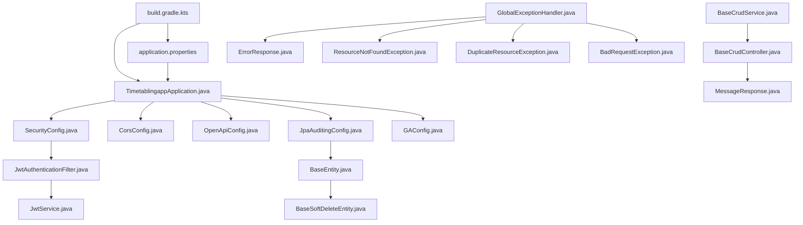

# Phase 1 — Project Initialization & Global Configuration

> **Reference:** [migration-roadmap.md](file:///c:/Users/Asus/Documents/Kuliah/Materi/Sem%208/Penelitian%20Ko%20Ray/Code/implementation-specs/migration-roadmap.md)
> **Reference:** [backend-spec.md](file:///c:/Users/Asus/Documents/Kuliah/Materi/Sem%208/Penelitian%20Ko%20Ray/Code/backup/backup%20random/backend-spec.md)
> **Goal:** A bootable Spring Boot 4.0.2 app with security, CORS, error handling, and base abstractions. `./gradlew bootRun` starts cleanly and Swagger UI is accessible.

---

## Table of Contents

1. [Current State](#1-current-state)
2. [Files Overview](#2-files-overview)
3. [New Files to Create](#3-new-files-to-create)
4. [Existing Files to Edit](#4-existing-files-to-edit)
5. [Files to Delete](#5-files-to-delete)
6. [Verification Criteria](#6-verification-criteria)

---

## 1. Current State

The previous conversation scaffolded empty stub classes with only package declarations. The following structure already exists at `Code/new/timetabling-backend/`:

```
new/timetabling-backend/
├── .gradle/
├── gradle/
├── gradlew
├── gradlew.bat
├── src/main/java/com/timetablingapp/
│   ├── TimetablingappApplication.java       ← empty stub
│   ├── config/
│   │   ├── SecurityConfig.java              ← empty stub
│   │   ├── JwtAuthenticationFilter.java     ← empty stub
│   │   ├── JwtService.java                  ← empty stub
│   │   ├── CorsConfig.java                  ← empty stub
│   │   ├── OpenApiConfig.java               ← empty stub
│   │   ├── JpaAuditingConfig.java           ← empty stub
│   │   └── GAConfig.java                    ← empty stub
│   └── common/
│       ├── base/
│       │   ├── BaseEntity.java              ← empty stub
│       │   ├── BaseSoftDeleteEntity.java    ← empty stub
│       │   ├── BaseCrudService.java         ← empty stub
│       │   └── BaseCrudController.java      ← empty stub
│       ├── dto/
│       │   ├── MessageResponse.java         ← empty stub
│       │   └── ImportResultResponse.java    ← empty stub
│       └── exception/
│           ├── GlobalExceptionHandler.java  ← empty stub
│           ├── ResourceNotFoundException.java ← empty stub
│           ├── DuplicateResourceException.java ← empty stub
│           ├── BadRequestException.java     ← empty stub
│           └── ErrorResponse.java           ← empty stub
├── src/main/resources/                      ← empty
└── src/test/java/com/timetablingapp/
    └── TimetablingappApplicationTests.java  ← empty stub
```

> [!IMPORTANT]
> No `build.gradle.kts`, `settings.gradle.kts`, or `application.properties` exist yet. These must be created. All 20 `.java` stubs need to be overwritten with full implementations.

---

## 2. Files Overview

### Action Summary (22 files total)

| # | File | Action | Status |
|---|------|--------|--------|
| 1 | `build.gradle.kts` | **CREATE** | New file |
| 2 | `settings.gradle.kts` | **CREATE** | New file |
| 3 | `src/main/resources/application.properties` | **CREATE** | New file |
| 4 | `src/main/resources/application-dev.properties` | **CREATE** | New file |
| 5 | `TimetablingappApplication.java` | **EDIT** | Overwrite stub |
| 6 | `config/SecurityConfig.java` | **EDIT** | Overwrite stub |
| 7 | `config/JwtAuthenticationFilter.java` | **EDIT** | Overwrite stub |
| 8 | `config/JwtService.java` | **EDIT** | Overwrite stub |
| 9 | `config/CorsConfig.java` | **EDIT** | Overwrite stub |
| 10 | `config/OpenApiConfig.java` | **EDIT** | Overwrite stub |
| 11 | `config/JpaAuditingConfig.java` | **EDIT** | Overwrite stub |
| 12 | `config/GAConfig.java` | **EDIT** | Overwrite stub |
| 13 | `common/base/BaseEntity.java` | **EDIT** | Overwrite stub |
| 14 | `common/base/BaseSoftDeleteEntity.java` | **EDIT** | Overwrite stub |
| 15 | `common/base/BaseCrudService.java` | **EDIT** | Overwrite stub |
| 16 | `common/base/BaseCrudController.java` | **EDIT** | Overwrite stub |
| 17 | `common/dto/MessageResponse.java` | **EDIT** | Overwrite stub |
| 18 | `common/dto/ImportResultResponse.java` | **EDIT** | Overwrite stub |
| 19 | `common/exception/GlobalExceptionHandler.java` | **EDIT** | Overwrite stub |
| 20 | `common/exception/ResourceNotFoundException.java` | **EDIT** | Overwrite stub |
| 21 | `common/exception/DuplicateResourceException.java` | **EDIT** | Overwrite stub |
| 22 | `common/exception/BadRequestException.java` | **EDIT** | Overwrite stub |
| 23 | `common/exception/ErrorResponse.java` | **EDIT** | Overwrite stub |
| 24 | `TimetablingappApplicationTests.java` | **EDIT** | Overwrite stub |

> [!NOTE]
> **No files need to be deleted** in Phase 1. All existing stubs will be edited in-place.

---

## 3. New Files to Create

All paths below are relative to `Code/new/timetabling-backend/`.

---

### 3.1 `build.gradle.kts`

**Path:** `Code/new/timetabling-backend/build.gradle.kts`
**Action:** CREATE
**Purpose:** Spring Boot 4.0.2 project with Java 21 toolchain and all required dependencies from the backend spec §1.

```kotlin
plugins {
    java
    id("org.springframework.boot") version "4.0.2"
    id("io.spring.dependency-management") version "1.1.7"
}

group = "com.timetablingapp"
version = "0.0.1-SNAPSHOT"
description = "Timetabling Backend - Spring Boot Migration"

java {
    toolchain {
        languageVersion = JavaLanguageVersion.of(21)
    }
}

configurations {
    compileOnly {
        extendsFrom(configurations.annotationProcessor.get())
    }
}

repositories {
    mavenCentral()
}

dependencies {
    // Spring Boot Starters
    implementation("org.springframework.boot:spring-boot-starter-web")
    implementation("org.springframework.boot:spring-boot-starter-data-jpa")
    implementation("org.springframework.boot:spring-boot-starter-security")
    implementation("org.springframework.boot:spring-boot-starter-validation")

    // JWT (jjwt)
    implementation("io.jsonwebtoken:jjwt-api:0.12.6")
    runtimeOnly("io.jsonwebtoken:jjwt-impl:0.12.6")
    runtimeOnly("io.jsonwebtoken:jjwt-jackson:0.12.6")

    // API Documentation (Swagger UI)
    implementation("org.springdoc:springdoc-openapi-starter-webmvc-ui:2.8.8")

    // Excel I/O (Apache POI) — needed in later phases but declared now
    implementation("org.apache.poi:poi-ooxml:5.3.0")

    // JSON Processing
    implementation("com.google.code.gson:gson")

    // Text Utilities
    implementation("org.apache.commons:commons-text:1.15.0")

    // Lombok
    compileOnly("org.projectlombok:lombok")
    annotationProcessor("org.projectlombok:lombok")

    // MySQL Driver
    runtimeOnly("com.mysql:mysql-connector-j")

    // Dev Tools
    developmentOnly("org.springframework.boot:spring-boot-devtools")

    // Testing
    testImplementation("org.springframework.boot:spring-boot-starter-test")
    testImplementation("org.springframework.security:spring-security-test")
    testRuntimeOnly("org.junit.platform:junit-platform-launcher")
}

tasks.withType<Test> {
    useJUnitPlatform()
}
```

> [!NOTE]
> The `group` is `com.timetablingapp` (matching the root package), different from the genetic project's `com.genetic`. The dependency `spring-boot-starter-security-oauth2-client` from the genetic project is NOT included — this project uses JWT-only auth.

---

### 3.2 `settings.gradle.kts`

**Path:** `Code/new/timetabling-backend/settings.gradle.kts`
**Action:** CREATE
**Purpose:** Defines the root project name.

```kotlin
rootProject.name = "timetablingapp"
```

---

### 3.3 `application.properties`

**Path:** `Code/new/timetabling-backend/src/main/resources/application.properties`
**Action:** CREATE
**Purpose:** Main application configuration. Connects to the existing Laravel MySQL database with `ddl-auto=validate`.

```properties
# ===========================
# APPLICATION
# ===========================
spring.application.name=timetablingapp
server.port=8080

# ===========================
# DATASOURCE (existing Laravel DB)
# ===========================
spring.datasource.url=jdbc:mysql://localhost:3306/timetab?useSSL=false&allowPublicKeyRetrieval=true&serverTimezone=Asia/Jakarta
spring.datasource.username=root
spring.datasource.password=Receiver1
spring.datasource.driver-class-name=com.mysql.cj.jdbc.Driver

# ===========================
# JPA / HIBERNATE
# ===========================
spring.jpa.hibernate.ddl-auto=validate
spring.jpa.show-sql=false
spring.jpa.properties.hibernate.format_sql=true
spring.jpa.properties.hibernate.dialect=org.hibernate.dialect.MySQLDialect
spring.jpa.open-in-view=false

# ===========================
# JWT CONFIGURATION
# ===========================
jwt.secret=kk01yAiWo4uX2QEd4f8DIUfSBSpN8Jfy34Bld2gVmWI
jwt.expiration=86400000

# ===========================
# GENETIC ALGORITHM DEFAULTS
# ===========================
ga.population-size=100
ga.generations=500
ga.crossover-rate=0.8
ga.mutation-rate=0.1

# ===========================
# SWAGGER / OPENAPI
# ===========================
springdoc.api-docs.path=/api-docs
springdoc.swagger-ui.path=/swagger-ui.html

# ===========================
# FILE UPLOAD LIMITS
# ===========================
spring.servlet.multipart.max-file-size=10MB
spring.servlet.multipart.max-request-size=10MB
```

> [!WARNING]
> The `spring.datasource.password` matches the Laravel `.env` file. In production, use environment variables or a secrets manager instead of hardcoding credentials.

---

### 3.4 `application-dev.properties`

**Path:** `Code/new/timetabling-backend/src/main/resources/application-dev.properties`
**Action:** CREATE
**Purpose:** Development profile overrides. Enables SQL logging and additional debug features.

```properties
# ===========================
# DEV PROFILE OVERRIDES
# ===========================
spring.jpa.show-sql=true
spring.jpa.properties.hibernate.format_sql=true

# More verbose logging for development
logging.level.com.timetablingapp=DEBUG
logging.level.org.springframework.security=DEBUG
logging.level.org.hibernate.SQL=DEBUG
logging.level.org.hibernate.type.descriptor.sql.BasicBinder=TRACE
```

---

## 4. Existing Files to Edit

All paths are relative to `Code/new/timetabling-backend/src/main/java/com/timetablingapp/`.

Each file below currently contains only a package declaration and an empty class body. Replace the **entire file contents** with the code shown.

---

### 4.1 `TimetablingappApplication.java`

**Path:** `src/main/java/com/timetablingapp/TimetablingappApplication.java`
**Action:** EDIT (overwrite stub)
**Purpose:** Spring Boot main entry point.

```java
package com.timetablingapp;

import org.springframework.boot.SpringApplication;
import org.springframework.boot.autoconfigure.SpringBootApplication;

@SpringBootApplication
public class TimetablingappApplication {

    public static void main(String[] args) {
        SpringApplication.run(TimetablingappApplication.class, args);
    }
}
```

---

### 4.2 `config/SecurityConfig.java`

**Path:** `src/main/java/com/timetablingapp/config/SecurityConfig.java`
**Action:** EDIT (overwrite stub)
**Purpose:** Stateless JWT security filter chain. Disables CSRF (stateless API), permits public endpoints (login, Swagger), and registers the JWT filter.

```java
package com.timetablingapp.config;

import lombok.RequiredArgsConstructor;
import org.springframework.context.annotation.Bean;
import org.springframework.context.annotation.Configuration;
import org.springframework.security.authentication.AuthenticationManager;
import org.springframework.security.config.annotation.authentication.configuration.AuthenticationConfiguration;
import org.springframework.security.config.annotation.method.configuration.EnableMethodSecurity;
import org.springframework.security.config.annotation.web.builders.HttpSecurity;
import org.springframework.security.config.annotation.web.configuration.EnableWebSecurity;
import org.springframework.security.config.annotation.web.configurers.AbstractHttpConfigurer;
import org.springframework.security.config.http.SessionCreationPolicy;
import org.springframework.security.crypto.bcrypt.BCryptPasswordEncoder;
import org.springframework.security.crypto.password.PasswordEncoder;
import org.springframework.security.web.SecurityFilterChain;
import org.springframework.security.web.authentication.UsernamePasswordAuthenticationFilter;

@Configuration
@EnableWebSecurity
@EnableMethodSecurity
@RequiredArgsConstructor
public class SecurityConfig {

    private final JwtAuthenticationFilter jwtAuthenticationFilter;

    @Bean
    public SecurityFilterChain securityFilterChain(HttpSecurity http) throws Exception {
        http
            .csrf(AbstractHttpConfigurer::disable)
            .sessionManagement(session ->
                session.sessionCreationPolicy(SessionCreationPolicy.STATELESS)
            )
            .authorizeHttpRequests(auth -> auth
                // Public endpoints
                .requestMatchers(
                    "/api/auth/login",
                    "/swagger-ui.html",
                    "/swagger-ui/**",
                    "/api-docs/**",
                    "/v3/api-docs/**"
                ).permitAll()
                // All other endpoints require authentication
                .anyRequest().authenticated()
            )
            .addFilterBefore(jwtAuthenticationFilter,
                UsernamePasswordAuthenticationFilter.class);

        return http.build();
    }

    @Bean
    public AuthenticationManager authenticationManager(
            AuthenticationConfiguration authConfig) throws Exception {
        return authConfig.getAuthenticationManager();
    }

    @Bean
    public PasswordEncoder passwordEncoder() {
        return new BCryptPasswordEncoder();
    }
}
```

> [!IMPORTANT]
> **Design Decision:** `@EnableMethodSecurity` is enabled so that individual controller methods can use `@PreAuthorize("hasRole('ADMIN')")` for fine-grained authorization (used in Phase 2+). Session policy is `STATELESS` — no server-side session is maintained.

---

### 4.3 `config/JwtAuthenticationFilter.java`

**Path:** `src/main/java/com/timetablingapp/config/JwtAuthenticationFilter.java`
**Action:** EDIT (overwrite stub)
**Purpose:** `OncePerRequestFilter` that extracts and validates the JWT from the `Authorization: Bearer <token>` header. If valid, sets the `SecurityContext`.

```java
package com.timetablingapp.config;

import jakarta.servlet.FilterChain;
import jakarta.servlet.ServletException;
import jakarta.servlet.http.HttpServletRequest;
import jakarta.servlet.http.HttpServletResponse;
import lombok.RequiredArgsConstructor;
import org.springframework.lang.NonNull;
import org.springframework.security.authentication.UsernamePasswordAuthenticationToken;
import org.springframework.security.core.authority.SimpleGrantedAuthority;
import org.springframework.security.core.context.SecurityContextHolder;
import org.springframework.security.web.authentication.WebAuthenticationDetailsSource;
import org.springframework.stereotype.Component;
import org.springframework.web.filter.OncePerRequestFilter;

import java.io.IOException;
import java.util.List;

@Component
@RequiredArgsConstructor
public class JwtAuthenticationFilter extends OncePerRequestFilter {

    private final JwtService jwtService;

    @Override
    protected void doFilterInternal(
            @NonNull HttpServletRequest request,
            @NonNull HttpServletResponse response,
            @NonNull FilterChain filterChain
    ) throws ServletException, IOException {

        final String authHeader = request.getHeader("Authorization");

        // Skip if no Bearer token present
        if (authHeader == null || !authHeader.startsWith("Bearer ")) {
            filterChain.doFilter(request, response);
            return;
        }

        final String jwt = authHeader.substring(7);

        try {
            if (jwtService.isTokenValid(jwt)) {
                String email = jwtService.extractEmail(jwt);
                String faculty = jwtService.extractFaculty(jwt);
                Long userId = jwtService.extractUserId(jwt);

                // Determine role: admin if faculty is null or empty
                String role = (faculty == null || faculty.isBlank())
                        ? "ROLE_ADMIN"
                        : "ROLE_FACULTY_USER";

                List<SimpleGrantedAuthority> authorities = List.of(
                        new SimpleGrantedAuthority(role)
                );

                // Build auth token with userId stored as principal details
                UsernamePasswordAuthenticationToken authToken =
                        new UsernamePasswordAuthenticationToken(
                                email,    // principal
                                userId,   // credentials (store userId for easy access)
                                authorities
                        );

                authToken.setDetails(
                        new WebAuthenticationDetailsSource()
                                .buildDetails(request)
                );

                SecurityContextHolder.getContext().setAuthentication(authToken);
            }
        } catch (Exception e) {
            // Token is invalid — do not set authentication, let Spring Security handle 401
            logger.debug("JWT validation failed: " + e.getMessage());
        }

        filterChain.doFilter(request, response);
    }
}
```

> [!NOTE]
> **Design Decision:** The `userId` is stored in the `credentials` field of `UsernamePasswordAuthenticationToken`. This allows controllers to easily extract the user ID via `SecurityContextHolder.getContext().getAuthentication().getCredentials()`. The `faculty` claim determines the role: null/empty faculty = ADMIN, otherwise FACULTY_USER.

---

### 4.4 `config/JwtService.java`

**Path:** `src/main/java/com/timetablingapp/config/JwtService.java`
**Action:** EDIT (overwrite stub)
**Purpose:** JWT token generation (HS256), validation, and claim extraction using the `jjwt` library.

```java
package com.timetablingapp.config;

import io.jsonwebtoken.Claims;
import io.jsonwebtoken.Jwts;
import io.jsonwebtoken.io.Decoders;
import io.jsonwebtoken.security.Keys;
import org.springframework.beans.factory.annotation.Value;
import org.springframework.stereotype.Service;

import javax.crypto.SecretKey;
import java.util.Date;
import java.util.HashMap;
import java.util.Map;
import java.util.function.Function;

@Service
public class JwtService {

    @Value("${jwt.secret}")
    private String secretKey;

    @Value("${jwt.expiration}")
    private long jwtExpiration;

    /**
     * Generate a JWT token for the given user details.
     *
     * @param userId  the user's database ID
     * @param email   the user's email (used as subject)
     * @param name    the user's display name
     * @param faculty the user's faculty (null for admin)
     * @return signed JWT string
     */
    public String generateToken(Long userId, String email, String name, String faculty) {
        Map<String, Object> claims = new HashMap<>();
        claims.put("userId", userId);
        claims.put("name", name);
        claims.put("faculty", faculty);

        return Jwts.builder()
                .claims(claims)
                .subject(email)
                .issuedAt(new Date(System.currentTimeMillis()))
                .expiration(new Date(System.currentTimeMillis() + jwtExpiration))
                .signWith(getSigningKey())
                .compact();
    }

    /**
     * Extract the email (subject) from the token.
     */
    public String extractEmail(String token) {
        return extractClaim(token, Claims::getSubject);
    }

    /**
     * Extract the user ID from the token claims.
     */
    public Long extractUserId(String token) {
        return extractClaim(token, claims -> claims.get("userId", Long.class));
    }

    /**
     * Extract the faculty from the token claims.
     */
    public String extractFaculty(String token) {
        return extractClaim(token, claims -> claims.get("faculty", String.class));
    }

    /**
     * Extract the user's name from the token claims.
     */
    public String extractName(String token) {
        return extractClaim(token, claims -> claims.get("name", String.class));
    }

    /**
     * Validate the token: not expired and parseable.
     */
    public boolean isTokenValid(String token) {
        try {
            extractAllClaims(token);
            return !isTokenExpired(token);
        } catch (Exception e) {
            return false;
        }
    }

    private boolean isTokenExpired(String token) {
        return extractExpiration(token).before(new Date());
    }

    private Date extractExpiration(String token) {
        return extractClaim(token, Claims::getExpiration);
    }

    private <T> T extractClaim(String token, Function<Claims, T> claimsResolver) {
        final Claims claims = extractAllClaims(token);
        return claimsResolver.apply(claims);
    }

    private Claims extractAllClaims(String token) {
        return Jwts.parser()
                .verifyWith(getSigningKey())
                .build()
                .parseSignedClaims(token)
                .getPayload();
    }

    private SecretKey getSigningKey() {
        byte[] keyBytes = Decoders.BASE64.decode(secretKey);
        return Keys.hmacShaKeyFor(keyBytes);
    }
}
```

> [!NOTE]
> The JWT secret is the same Base64-encoded key used in the Laravel `.env` (`APP_KEY`). The token encodes `userId`, `name`, `faculty`, and `email` (as subject). Expiration defaults to 24 hours (86400000 ms).

---

### 4.5 `config/CorsConfig.java`

**Path:** `src/main/java/com/timetablingapp/config/CorsConfig.java`
**Action:** EDIT (overwrite stub)
**Purpose:** Configurable CORS policy for the frontend SPA origin.

```java
package com.timetablingapp.config;

import org.springframework.context.annotation.Bean;
import org.springframework.context.annotation.Configuration;
import org.springframework.web.cors.CorsConfiguration;
import org.springframework.web.cors.UrlBasedCorsConfigurationSource;
import org.springframework.web.filter.CorsFilter;

import java.util.Arrays;
import java.util.List;

@Configuration
public class CorsConfig {

    @Bean
    public CorsFilter corsFilter() {
        CorsConfiguration config = new CorsConfiguration();

        // Allowed frontend origins
        config.setAllowedOrigins(Arrays.asList(
                "http://localhost:3000",   // Vite dev server
                "http://localhost:5173",   // Vite default
                "http://localhost:8080"    // Same origin
        ));

        config.setAllowedMethods(Arrays.asList(
                "GET", "POST", "PUT", "DELETE", "PATCH", "OPTIONS"
        ));

        config.setAllowedHeaders(List.of("*"));
        config.setAllowCredentials(true);
        config.setMaxAge(3600L);

        UrlBasedCorsConfigurationSource source = new UrlBasedCorsConfigurationSource();
        source.registerCorsConfiguration("/api/**", config);
        source.registerCorsConfiguration("/swagger-ui/**", config);
        source.registerCorsConfiguration("/api-docs/**", config);
        source.registerCorsConfiguration("/v3/api-docs/**", config);

        return new CorsFilter(source);
    }
}
```

---

### 4.6 `config/OpenApiConfig.java`

**Path:** `src/main/java/com/timetablingapp/config/OpenApiConfig.java`
**Action:** EDIT (overwrite stub)
**Purpose:** Swagger UI metadata and JWT Bearer authentication scheme for testing endpoints.

```java
package com.timetablingapp.config;

import io.swagger.v3.oas.models.Components;
import io.swagger.v3.oas.models.OpenAPI;
import io.swagger.v3.oas.models.info.Contact;
import io.swagger.v3.oas.models.info.Info;
import io.swagger.v3.oas.models.security.SecurityRequirement;
import io.swagger.v3.oas.models.security.SecurityScheme;
import org.springframework.context.annotation.Bean;
import org.springframework.context.annotation.Configuration;

@Configuration
public class OpenApiConfig {

    @Bean
    public OpenAPI customOpenAPI() {
        final String securitySchemeName = "bearerAuth";

        return new OpenAPI()
                .info(new Info()
                        .title("Timetabling Backend API")
                        .version("1.0.0")
                        .description("Spring Boot backend for the Timetabling application. "
                                + "Migrated from Laravel.")
                        .contact(new Contact()
                                .name("Timetabling Team")
                        )
                )
                .addSecurityItem(new SecurityRequirement()
                        .addList(securitySchemeName)
                )
                .components(new Components()
                        .addSecuritySchemes(securitySchemeName,
                                new SecurityScheme()
                                        .name(securitySchemeName)
                                        .type(SecurityScheme.Type.HTTP)
                                        .scheme("bearer")
                                        .bearerFormat("JWT")
                                        .description("Enter your JWT token")
                        )
                );
    }
}
```

---

### 4.7 `config/JpaAuditingConfig.java`

**Path:** `src/main/java/com/timetablingapp/config/JpaAuditingConfig.java`
**Action:** EDIT (overwrite stub)
**Purpose:** Enables JPA Auditing so `@CreatedDate` and `@LastModifiedDate` annotations work on entities.

```java
package com.timetablingapp.config;

import org.springframework.context.annotation.Configuration;
import org.springframework.data.jpa.repository.config.EnableJpaAuditing;

@Configuration
@EnableJpaAuditing
public class JpaAuditingConfig {
    // Enables @CreatedDate and @LastModifiedDate on BaseEntity
}
```

---

### 4.8 `config/GAConfig.java`

**Path:** `src/main/java/com/timetablingapp/config/GAConfig.java`
**Action:** EDIT (overwrite stub)
**Purpose:** Externalized genetic algorithm configuration via `@ConfigurationProperties`. Values come from `application.properties` under the `ga.*` prefix.

```java
package com.timetablingapp.config;

import lombok.Getter;
import lombok.Setter;
import org.springframework.boot.context.properties.ConfigurationProperties;
import org.springframework.context.annotation.Configuration;

@Configuration
@ConfigurationProperties(prefix = "ga")
@Getter
@Setter
public class GAConfig {

    /**
     * Number of chromosomes per generation.
     * Default: 100
     */
    private int populationSize = 100;

    /**
     * Maximum number of generations to evolve.
     * Default: 500
     */
    private int generations = 500;

    /**
     * Probability of crossover between two chromosomes (0.0 - 1.0).
     * Default: 0.8
     */
    private double crossoverRate = 0.8;

    /**
     * Probability of mutation for each gene (0.0 - 1.0).
     * Default: 0.1
     */
    private double mutationRate = 0.1;
}
```

---

### 4.9 `common/base/BaseEntity.java`

**Path:** `src/main/java/com/timetablingapp/common/base/BaseEntity.java`
**Action:** EDIT (overwrite stub)
**Purpose:** `@MappedSuperclass` providing `createdAt` and `updatedAt` audit timestamps via JPA Auditing. All entities that need timestamps extend this.

```java
package com.timetablingapp.common.base;

import jakarta.persistence.Column;
import jakarta.persistence.EntityListeners;
import jakarta.persistence.MappedSuperclass;
import lombok.Getter;
import lombok.Setter;
import org.springframework.data.annotation.CreatedDate;
import org.springframework.data.annotation.LastModifiedDate;
import org.springframework.data.jpa.domain.support.AuditingEntityListener;

import java.time.LocalDateTime;

@MappedSuperclass
@EntityListeners(AuditingEntityListener.class)
@Getter
@Setter
public abstract class BaseEntity {

    @CreatedDate
    @Column(name = "created_at", nullable = false, updatable = false)
    private LocalDateTime createdAt;

    @LastModifiedDate
    @Column(name = "updated_at")
    private LocalDateTime updatedAt;
}
```

> [!NOTE]
> **Column Naming:** The Laravel database uses `snake_case` columns (`created_at`, `updated_at`). The `@Column(name = ...)` annotation ensures JPA maps correctly even without a naming strategy override. Spring Boot's default physical naming strategy already converts camelCase to snake_case, but explicit mapping is safer for validation against the existing schema.

---

### 4.10 `common/base/BaseSoftDeleteEntity.java`

**Path:** `src/main/java/com/timetablingapp/common/base/BaseSoftDeleteEntity.java`
**Action:** EDIT (overwrite stub)
**Purpose:** Extends `BaseEntity` with a `deletedAt` field for soft-delete support. Entities that use soft delete extend this and add `@SQLDelete` + `@SQLRestriction` annotations at the entity level.

```java
package com.timetablingapp.common.base;

import jakarta.persistence.Column;
import jakarta.persistence.MappedSuperclass;
import lombok.Getter;
import lombok.Setter;

import java.time.LocalDateTime;

@MappedSuperclass
@Getter
@Setter
public abstract class BaseSoftDeleteEntity extends BaseEntity {

    @Column(name = "deleted_at")
    private LocalDateTime deletedAt;
}
```

> [!IMPORTANT]
> **Usage Pattern:** Entities that use soft delete must add the following annotations at the class level:
> ```java
> @SQLDelete(sql = "UPDATE table_name SET deleted_at = NOW() WHERE id = ?")
> @SQLRestriction("deleted_at IS NULL")
> ```
> The `BaseSoftDeleteEntity` only provides the field — the delete behavior is configured per-entity since each entity has a different table name.

---

### 4.11 `common/base/BaseCrudService.java`

**Path:** `src/main/java/com/timetablingapp/common/base/BaseCrudService.java`
**Action:** EDIT (overwrite stub)
**Purpose:** Generic CRUD service interface defining the standard five operations. All domain services implement this.

```java
package com.timetablingapp.common.base;

import java.util.List;

/**
 * Generic CRUD service interface.
 *
 * @param <RES> Response DTO type
 * @param <REQ> Request DTO type
 * @param <ID>  Entity ID type
 */
public interface BaseCrudService<RES, REQ, ID> {

    /**
     * Retrieve all entities as response DTOs.
     */
    List<RES> findAll();

    /**
     * Retrieve a single entity by its ID.
     *
     * @throws com.timetablingapp.common.exception.ResourceNotFoundException if not found
     */
    RES findById(ID id);

    /**
     * Create a new entity from the request DTO.
     */
    RES create(REQ request);

    /**
     * Update an existing entity by ID with the request DTO.
     *
     * @throws com.timetablingapp.common.exception.ResourceNotFoundException if not found
     */
    RES update(ID id, REQ request);

    /**
     * Delete an entity by its ID.
     *
     * @throws com.timetablingapp.common.exception.ResourceNotFoundException if not found
     */
    void delete(ID id);
}
```

---

### 4.12 `common/base/BaseCrudController.java`

**Path:** `src/main/java/com/timetablingapp/common/base/BaseCrudController.java`
**Action:** EDIT (overwrite stub)
**Purpose:** Abstract generic REST controller with 5 standard CRUD endpoint methods. Domain controllers extend this to inherit GET (list/by-id), POST, PUT, DELETE behavior.

```java
package com.timetablingapp.common.base;

import com.timetablingapp.common.dto.MessageResponse;
import jakarta.validation.Valid;
import org.springframework.http.HttpStatus;
import org.springframework.http.ResponseEntity;
import org.springframework.web.bind.annotation.*;

import java.util.List;

/**
 * Abstract base REST controller providing standard CRUD endpoints.
 * <p>
 * Subclasses must:
 * <ul>
 *   <li>Add {@code @RestController} and {@code @RequestMapping} annotations</li>
 *   <li>Provide the concrete service via constructor injection</li>
 * </ul>
 *
 * @param <RES> Response DTO type
 * @param <REQ> Request DTO type
 * @param <ID>  Entity ID type
 */
public abstract class BaseCrudController<RES, REQ, ID> {

    protected final BaseCrudService<RES, REQ, ID> service;

    protected BaseCrudController(BaseCrudService<RES, REQ, ID> service) {
        this.service = service;
    }

    @GetMapping
    public ResponseEntity<List<RES>> getAll() {
        return ResponseEntity.ok(service.findAll());
    }

    @GetMapping("/{id}")
    public ResponseEntity<RES> getById(@PathVariable ID id) {
        return ResponseEntity.ok(service.findById(id));
    }

    @PostMapping
    public ResponseEntity<RES> create(@Valid @RequestBody REQ request) {
        RES created = service.create(request);
        return ResponseEntity.status(HttpStatus.CREATED).body(created);
    }

    @PutMapping("/{id}")
    public ResponseEntity<RES> update(
            @PathVariable ID id,
            @Valid @RequestBody REQ request) {
        return ResponseEntity.ok(service.update(id, request));
    }

    @DeleteMapping("/{id}")
    public ResponseEntity<MessageResponse> delete(@PathVariable ID id) {
        service.delete(id);
        return ResponseEntity.ok(MessageResponse.success("Resource deleted successfully"));
    }
}
```

> [!NOTE]
> **Why abstract without @RestController?** The `@RestController` and `@RequestMapping` annotations must be on the subclass so each domain defines its own base path (e.g., `/api/courses`). This avoids path conflicts.

---

### 4.13 `common/dto/MessageResponse.java`

**Path:** `src/main/java/com/timetablingapp/common/dto/MessageResponse.java`
**Action:** EDIT (overwrite stub)
**Purpose:** Standard JSON response body for simple success/error messages: `{ success, message, timestamp }`.

```java
package com.timetablingapp.common.dto;

import com.fasterxml.jackson.annotation.JsonInclude;
import lombok.AllArgsConstructor;
import lombok.Builder;
import lombok.Getter;
import lombok.NoArgsConstructor;
import lombok.Setter;

import java.time.LocalDateTime;

@Getter
@Setter
@Builder
@NoArgsConstructor
@AllArgsConstructor
@JsonInclude(JsonInclude.Include.NON_NULL)
public class MessageResponse {

    private boolean success;
    private String message;

    @Builder.Default
    private LocalDateTime timestamp = LocalDateTime.now();

    /**
     * Factory method for a success response.
     */
    public static MessageResponse success(String message) {
        return MessageResponse.builder()
                .success(true)
                .message(message)
                .timestamp(LocalDateTime.now())
                .build();
    }

    /**
     * Factory method for an error response.
     */
    public static MessageResponse error(String message) {
        return MessageResponse.builder()
                .success(false)
                .message(message)
                .timestamp(LocalDateTime.now())
                .build();
    }
}
```

---

### 4.14 `common/dto/ImportResultResponse.java`

**Path:** `src/main/java/com/timetablingapp/common/dto/ImportResultResponse.java`
**Action:** EDIT (overwrite stub)
**Purpose:** Response body for Excel import operations: `{ success, message, importedCount, errors }`. Used in Phase 9 but declared now.

```java
package com.timetablingapp.common.dto;

import com.fasterxml.jackson.annotation.JsonInclude;
import lombok.AllArgsConstructor;
import lombok.Builder;
import lombok.Getter;
import lombok.NoArgsConstructor;
import lombok.Setter;

import java.util.List;

@Getter
@Setter
@Builder
@NoArgsConstructor
@AllArgsConstructor
@JsonInclude(JsonInclude.Include.NON_NULL)
public class ImportResultResponse {

    private boolean success;
    private String message;
    private int importedCount;
    private List<String> errors;

    /**
     * Factory method for a successful import.
     */
    public static ImportResultResponse success(String message, int importedCount) {
        return ImportResultResponse.builder()
                .success(true)
                .message(message)
                .importedCount(importedCount)
                .build();
    }

    /**
     * Factory method for an import with errors.
     */
    public static ImportResultResponse withErrors(
            String message, int importedCount, List<String> errors) {
        return ImportResultResponse.builder()
                .success(errors.isEmpty())
                .message(message)
                .importedCount(importedCount)
                .errors(errors)
                .build();
    }
}
```

---

### 4.15 `common/exception/ErrorResponse.java`

**Path:** `src/main/java/com/timetablingapp/common/exception/ErrorResponse.java`
**Action:** EDIT (overwrite stub)
**Purpose:** Standard JSON error body matching the spec §5.2: `success`, `status`, `error`, `message`, `path`, `timestamp`, `fieldErrors`.

```java
package com.timetablingapp.common.exception;

import com.fasterxml.jackson.annotation.JsonInclude;
import lombok.AllArgsConstructor;
import lombok.Builder;
import lombok.Getter;
import lombok.NoArgsConstructor;
import lombok.Setter;

import java.time.LocalDateTime;
import java.util.List;

@Getter
@Setter
@Builder
@NoArgsConstructor
@AllArgsConstructor
@JsonInclude(JsonInclude.Include.NON_NULL)
public class ErrorResponse {

    @Builder.Default
    private boolean success = false;

    private int status;
    private String error;
    private String message;
    private String path;

    @Builder.Default
    private LocalDateTime timestamp = LocalDateTime.now();

    private List<FieldError> fieldErrors;

    @Getter
    @Setter
    @Builder
    @NoArgsConstructor
    @AllArgsConstructor
    public static class FieldError {
        private String field;
        private String message;
        private Object rejectedValue;
    }
}
```

---

### 4.16 `common/exception/ResourceNotFoundException.java`

**Path:** `src/main/java/com/timetablingapp/common/exception/ResourceNotFoundException.java`
**Action:** EDIT (overwrite stub)
**Purpose:** Thrown when an entity is not found by ID or query. Results in HTTP 404.

```java
package com.timetablingapp.common.exception;

import lombok.Getter;

@Getter
public class ResourceNotFoundException extends RuntimeException {

    private final String resourceName;
    private final String fieldName;
    private final Object fieldValue;

    public ResourceNotFoundException(String resourceName, String fieldName, Object fieldValue) {
        super(String.format("%s not found with %s: '%s'", resourceName, fieldName, fieldValue));
        this.resourceName = resourceName;
        this.fieldName = fieldName;
        this.fieldValue = fieldValue;
    }
}
```

---

### 4.17 `common/exception/DuplicateResourceException.java`

**Path:** `src/main/java/com/timetablingapp/common/exception/DuplicateResourceException.java`
**Action:** EDIT (overwrite stub)
**Purpose:** Thrown on unique constraint violations. Results in HTTP 409.

```java
package com.timetablingapp.common.exception;

import lombok.Getter;

@Getter
public class DuplicateResourceException extends RuntimeException {

    private final String resourceName;
    private final String fieldName;
    private final Object fieldValue;

    public DuplicateResourceException(String resourceName, String fieldName, Object fieldValue) {
        super(String.format("%s already exists with %s: '%s'", resourceName, fieldName, fieldValue));
        this.resourceName = resourceName;
        this.fieldName = fieldName;
        this.fieldValue = fieldValue;
    }
}
```

---

### 4.18 `common/exception/BadRequestException.java`

**Path:** `src/main/java/com/timetablingapp/common/exception/BadRequestException.java`
**Action:** EDIT (overwrite stub)
**Purpose:** Thrown for business rule violations. Results in HTTP 400.

```java
package com.timetablingapp.common.exception;

public class BadRequestException extends RuntimeException {

    public BadRequestException(String message) {
        super(message);
    }
}
```

---

### 4.19 `common/exception/GlobalExceptionHandler.java`

**Path:** `src/main/java/com/timetablingapp/common/exception/GlobalExceptionHandler.java`
**Action:** EDIT (overwrite stub)
**Purpose:** `@RestControllerAdvice` with all 10 exception handlers from the spec §5.3. Maps each exception type to the correct HTTP status and returns a standardized `ErrorResponse` JSON body.

```java
package com.timetablingapp.common.exception;

import jakarta.servlet.http.HttpServletRequest;
import jakarta.validation.ConstraintViolationException;
import lombok.extern.slf4j.Slf4j;
import org.springframework.dao.DataIntegrityViolationException;
import org.springframework.http.HttpStatus;
import org.springframework.http.ResponseEntity;
import org.springframework.http.converter.HttpMessageNotReadableException;
import org.springframework.security.access.AccessDeniedException;
import org.springframework.security.core.AuthenticationException;
import org.springframework.web.HttpRequestMethodNotSupportedException;
import org.springframework.web.bind.MethodArgumentNotValidException;
import org.springframework.web.bind.annotation.ExceptionHandler;
import org.springframework.web.bind.annotation.RestControllerAdvice;
import org.springframework.web.multipart.MaxUploadSizeExceededException;

import java.time.LocalDateTime;
import java.util.List;

@Slf4j
@RestControllerAdvice
public class GlobalExceptionHandler {

    // ──────────────────────────────────────
    // 1. ResourceNotFoundException → 404
    // ──────────────────────────────────────
    @ExceptionHandler(ResourceNotFoundException.class)
    public ResponseEntity<ErrorResponse> handleResourceNotFound(
            ResourceNotFoundException ex, HttpServletRequest request) {
        log.warn("Resource not found: {}", ex.getMessage());
        return buildResponse(HttpStatus.NOT_FOUND, ex.getMessage(), request);
    }

    // ──────────────────────────────────────
    // 2. DuplicateResourceException → 409
    // ──────────────────────────────────────
    @ExceptionHandler(DuplicateResourceException.class)
    public ResponseEntity<ErrorResponse> handleDuplicateResource(
            DuplicateResourceException ex, HttpServletRequest request) {
        log.warn("Duplicate resource: {}", ex.getMessage());
        return buildResponse(HttpStatus.CONFLICT, ex.getMessage(), request);
    }

    // ──────────────────────────────────────
    // 3. BadRequestException → 400
    // ──────────────────────────────────────
    @ExceptionHandler(BadRequestException.class)
    public ResponseEntity<ErrorResponse> handleBadRequest(
            BadRequestException ex, HttpServletRequest request) {
        log.warn("Bad request: {}", ex.getMessage());
        return buildResponse(HttpStatus.BAD_REQUEST, ex.getMessage(), request);
    }

    // ──────────────────────────────────────
    // 4. MethodArgumentNotValidException → 422
    //    (Bean Validation @Valid failures)
    // ──────────────────────────────────────
    @ExceptionHandler(MethodArgumentNotValidException.class)
    public ResponseEntity<ErrorResponse> handleValidation(
            MethodArgumentNotValidException ex, HttpServletRequest request) {
        log.warn("Validation failed: {}", ex.getMessage());

        List<ErrorResponse.FieldError> fieldErrors = ex.getBindingResult()
                .getFieldErrors()
                .stream()
                .map(error -> ErrorResponse.FieldError.builder()
                        .field(error.getField())
                        .message(error.getDefaultMessage())
                        .rejectedValue(error.getRejectedValue())
                        .build())
                .toList();

        ErrorResponse response = ErrorResponse.builder()
                .success(false)
                .status(HttpStatus.UNPROCESSABLE_ENTITY.value())
                .error(HttpStatus.UNPROCESSABLE_ENTITY.getReasonPhrase())
                .message("Validation failed")
                .path(request.getRequestURI())
                .timestamp(LocalDateTime.now())
                .fieldErrors(fieldErrors)
                .build();

        return ResponseEntity.status(HttpStatus.UNPROCESSABLE_ENTITY).body(response);
    }

    // ──────────────────────────────────────
    // 5. ConstraintViolationException → 422
    //    (Path variable / param validation)
    // ──────────────────────────────────────
    @ExceptionHandler(ConstraintViolationException.class)
    public ResponseEntity<ErrorResponse> handleConstraintViolation(
            ConstraintViolationException ex, HttpServletRequest request) {
        log.warn("Constraint violation: {}", ex.getMessage());
        return buildResponse(HttpStatus.UNPROCESSABLE_ENTITY, ex.getMessage(), request);
    }

    // ──────────────────────────────────────
    // 6. HttpMessageNotReadableException → 400
    //    (Malformed JSON body)
    // ──────────────────────────────────────
    @ExceptionHandler(HttpMessageNotReadableException.class)
    public ResponseEntity<ErrorResponse> handleMessageNotReadable(
            HttpMessageNotReadableException ex, HttpServletRequest request) {
        log.warn("Malformed request body: {}", ex.getMessage());
        return buildResponse(HttpStatus.BAD_REQUEST, "Malformed JSON request body", request);
    }

    // ──────────────────────────────────────
    // 7. HttpRequestMethodNotSupportedException → 405
    // ──────────────────────────────────────
    @ExceptionHandler(HttpRequestMethodNotSupportedException.class)
    public ResponseEntity<ErrorResponse> handleMethodNotSupported(
            HttpRequestMethodNotSupportedException ex, HttpServletRequest request) {
        log.warn("Method not supported: {}", ex.getMessage());
        String message = String.format("HTTP method '%s' is not supported for this endpoint",
                ex.getMethod());
        return buildResponse(HttpStatus.METHOD_NOT_ALLOWED, message, request);
    }

    // ──────────────────────────────────────
    // 8. AccessDeniedException → 403
    // ──────────────────────────────────────
    @ExceptionHandler(AccessDeniedException.class)
    public ResponseEntity<ErrorResponse> handleAccessDenied(
            AccessDeniedException ex, HttpServletRequest request) {
        log.warn("Access denied: {}", ex.getMessage());
        return buildResponse(HttpStatus.FORBIDDEN, "Access denied: insufficient permissions",
                request);
    }

    // ──────────────────────────────────────
    // 9. AuthenticationException → 401
    // ──────────────────────────────────────
    @ExceptionHandler(AuthenticationException.class)
    public ResponseEntity<ErrorResponse> handleAuthentication(
            AuthenticationException ex, HttpServletRequest request) {
        log.warn("Authentication failed: {}", ex.getMessage());
        return buildResponse(HttpStatus.UNAUTHORIZED, "Authentication failed: invalid or expired token",
                request);
    }

    // ──────────────────────────────────────
    // 10. DataIntegrityViolationException → 409
    // ──────────────────────────────────────
    @ExceptionHandler(DataIntegrityViolationException.class)
    public ResponseEntity<ErrorResponse> handleDataIntegrity(
            DataIntegrityViolationException ex, HttpServletRequest request) {
        log.error("Data integrity violation: {}", ex.getMessage());
        return buildResponse(HttpStatus.CONFLICT,
                "Database constraint violation. Please check your data.", request);
    }

    // ──────────────────────────────────────
    // 11. MaxUploadSizeExceededException → 413
    // ──────────────────────────────────────
    @ExceptionHandler(MaxUploadSizeExceededException.class)
    public ResponseEntity<ErrorResponse> handleMaxUploadSize(
            MaxUploadSizeExceededException ex, HttpServletRequest request) {
        log.warn("File upload too large: {}", ex.getMessage());
        return buildResponse(HttpStatus.PAYLOAD_TOO_LARGE,
                "File size exceeds the maximum allowed upload size", request);
    }

    // ──────────────────────────────────────
    // FALLBACK: Exception → 500
    // ──────────────────────────────────────
    @ExceptionHandler(Exception.class)
    public ResponseEntity<ErrorResponse> handleGenericException(
            Exception ex, HttpServletRequest request) {
        log.error("Unexpected error: ", ex);
        return buildResponse(HttpStatus.INTERNAL_SERVER_ERROR,
                "An unexpected error occurred", request);
    }

    // ──────────────────────────────────────
    // Helper: build standard ErrorResponse
    // ──────────────────────────────────────
    private ResponseEntity<ErrorResponse> buildResponse(
            HttpStatus status, String message, HttpServletRequest request) {
        ErrorResponse response = ErrorResponse.builder()
                .success(false)
                .status(status.value())
                .error(status.getReasonPhrase())
                .message(message)
                .path(request.getRequestURI())
                .timestamp(LocalDateTime.now())
                .build();

        return ResponseEntity.status(status).body(response);
    }
}
```

> [!IMPORTANT]
> **Handler Count:** There are 11 exception handlers (10 from spec §5.3 + the `MaxUploadSizeExceededException` handler mentioned in the spec table), plus a generic fallback for 500 errors. The spec mentions 10 but includes the fallback in the mapping table as well.

---

### 4.20 `TimetablingappApplicationTests.java`

**Path:** `src/test/java/com/timetablingapp/TimetablingappApplicationTests.java`
**Action:** EDIT (overwrite stub)
**Purpose:** Basic Spring Boot context load test.

```java
package com.timetablingapp;

import org.junit.jupiter.api.Test;
import org.springframework.boot.test.context.SpringBootTest;

@SpringBootTest
class TimetablingappApplicationTests {

    @Test
    void contextLoads() {
        // Verifies that the Spring application context starts successfully
    }
}
```

---

## 5. Files to Delete

> [!NOTE]
> **No files need to be deleted in Phase 1.** All existing files are stubs that will be overwritten with their full implementations as described above.

---

## 6. Verification Criteria

After all Phase 1 files are implemented, verify the following:

### 6.1 Build Verification

```bash
./gradlew clean build
```

- [ ] Build completes with **zero errors**
- [ ] All dependencies resolve successfully

### 6.2 Application Startup

```bash
./gradlew bootRun
```

- [ ] Application starts on port 8080 (or configured port)
- [ ] No bean creation errors
- [ ] JPA validation against existing MySQL database succeeds (`ddl-auto=validate`)

### 6.3 Swagger UI

- [ ] Navigate to `http://localhost:8080/swagger-ui.html`
- [ ] Swagger UI loads and displays the API documentation
- [ ] JWT Bearer auth scheme is visible in the "Authorize" button

### 6.4 Error Handling

- [ ] `GET /api/nonexistent` returns standardized `ErrorResponse` JSON with 401 (unauthenticated) or 404 (after authentication)
- [ ] `POST /api/auth/login` (public endpoint) is accessible without authentication
- [ ] Invalid JSON body returns HTTP 400 with `ErrorResponse`

### 6.5 Security

- [ ] All endpoints except `/api/auth/login` and Swagger paths return **401 Unauthorized** without a Bearer token
- [ ] CORS headers are present in responses for allowed origins

---

## Appendix: Dependency Between Phase 1 Files



> [!TIP]
> **Recommended implementation order:**
> 1. `build.gradle.kts` + `settings.gradle.kts`
> 2. `application.properties` + `application-dev.properties`
> 3. `TimetablingappApplication.java`
> 4. `BaseEntity.java` → `BaseSoftDeleteEntity.java`
> 5. `ErrorResponse.java` → Exception classes → `GlobalExceptionHandler.java`
> 6. `MessageResponse.java` → `ImportResultResponse.java`
> 7. `BaseCrudService.java` → `BaseCrudController.java`
> 8. `JwtService.java` → `JwtAuthenticationFilter.java` → `SecurityConfig.java`
> 9. `CorsConfig.java`, `OpenApiConfig.java`, `JpaAuditingConfig.java`, `GAConfig.java`
> 10. `TimetablingappApplicationTests.java`
