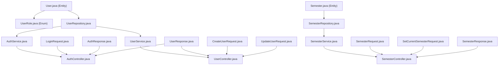

# Phase 2 — Core Domain: `auth/` and `semester/`

> **Reference:** [migration-roadmap.md](file:///c:/Users/Asus/Documents/Kuliah/Materi/Sem%208/Penelitian%20Ko%20Ray/Code/implementation-specs/migration-roadmap.md)
> **Reference:** [backend-spec.md](file:///c:/Users/Asus/Documents/Kuliah/Materi/Sem%208/Penelitian%20Ko%20Ray/Code/backup/backup%20random/backend-spec.md)
> **Depends on:** Phase 1 (config/, common/) — ✅ Complete
> **Goal:** Working JWT authentication + user management + semester management. Login flow is functional end-to-end.

---

## Table of Contents

1. [Current State](#1-current-state)
2. [Files Overview](#2-files-overview)
3. [Auth Package Implementation](#3-auth-package-implementation)
4. [Semester Package Implementation](#4-semester-package-implementation)
5. [Files to Delete](#5-files-to-delete)
6. [Verification Criteria](#6-verification-criteria)

---

## 1. Current State

Phase 1 is complete. The following infrastructure is in place:
- `SecurityConfig.java` — JWT stateless filter chain with `/api/auth/login` as public endpoint
- `JwtAuthenticationFilter.java` — Extracts JWT from `Authorization: Bearer` header
- `JwtService.java` — Token generation (HS256), validation, claim extraction
- `BaseEntity.java` / `BaseSoftDeleteEntity.java` — Audit timestamps and soft delete base classes
- `BaseCrudService.java` / `BaseCrudController.java` — Generic CRUD abstractions
- `GlobalExceptionHandler.java` — Standardized error responses
- `application.properties` — Database connection, JWT secret, etc.

The `auth/` and `semester/` packages do **not yet exist** and must be created from scratch.

---

## 2. Files Overview

### Action Summary (19 files total)

| # | File | Package | Action | Purpose |
|---|------|---------|--------|---------|
| 1 | `User.java` | `auth/` | **CREATE** | `@Entity` mapping to `users` table |
| 2 | `UserRole.java` | `auth/` | **CREATE** | Enum: `ADMIN`, `FACULTY_USER` |
| 3 | `UserRepository.java` | `auth/` | **CREATE** | Spring Data JPA repository |
| 4 | `AuthController.java` | `auth/` | **CREATE** | POST /api/auth/login, logout, me |
| 5 | `AuthService.java` | `auth/` | **CREATE** | Login logic, JWT generation |
| 6 | `LoginRequest.java` | `auth/` | **CREATE** | Login request DTO |
| 7 | `AuthResponse.java` | `auth/` | **CREATE** | Login response DTO (token + user) |
| 8 | `UserController.java` | `auth/` | **CREATE** | CRUD /api/users (ADMIN only) |
| 9 | `UserService.java` | `auth/` | **CREATE** | User CRUD business logic |
| 10 | `CreateUserRequest.java` | `auth/` | **CREATE** | Create user request DTO |
| 11 | `UpdateUserRequest.java` | `auth/` | **CREATE** | Update user request DTO |
| 12 | `UserResponse.java` | `auth/` | **CREATE** | User response DTO |
| 13 | `Semester.java` | `semester/` | **CREATE** | `@Entity` with soft delete |
| 14 | `SemesterRepository.java` | `semester/` | **CREATE** | Spring Data JPA repository |
| 15 | `SemesterController.java` | `semester/` | **CREATE** | CRUD + next/duplicate/current |
| 16 | `SemesterService.java` | `semester/` | **CREATE** | Semester business logic |
| 17 | `SemesterRequest.java` | `semester/` | **CREATE** | Create/update semester request DTO |
| 18 | `SetCurrentSemesterRequest.java` | `semester/` | **CREATE** | Set current semester request DTO |
| 19 | `SemesterResponse.java` | `semester/` | **CREATE** | Semester response DTO |

> [!NOTE]
> **No existing files need to be edited or deleted** in Phase 2. All 19 files are brand new.

---

## 3. Auth Package Implementation

All paths are relative to `Code/new/timetabling-backend/src/main/java/com/timetablingapp/`.

---

### 3.1 `auth/User.java`

**Path:** `src/main/java/com/timetablingapp/auth/User.java`
**Action:** CREATE
**Purpose:** JPA entity mapping to the existing Laravel `users` table. Uses `BaseEntity` for audit timestamps. **No soft delete** (matching the Laravel model which doesn't use `SoftDeletes`).

**Database Schema (from Laravel migrations):**
```sql
-- 2014_10_12_000000_create_users_table.php
CREATE TABLE users (
    id BIGINT UNSIGNED AUTO_INCREMENT PRIMARY KEY,
    name VARCHAR(255) NOT NULL,
    email VARCHAR(255) UNIQUE NOT NULL,
    email_verified_at TIMESTAMP NULL,
    password VARCHAR(255) NOT NULL,
    remember_token VARCHAR(100) NULL,
    created_at TIMESTAMP NULL,
    updated_at TIMESTAMP NULL
);

-- 2021_01_20_163018_add_faculty_to_user.php
ALTER TABLE users ADD faculty VARCHAR(255) NULL;
```

```java
package com.timetablingapp.auth;

import com.fasterxml.jackson.annotation.JsonIgnore;
import com.timetablingapp.common.base.BaseEntity;
import jakarta.persistence.*;
import jakarta.validation.constraints.Email;
import jakarta.validation.constraints.NotBlank;
import lombok.AllArgsConstructor;
import lombok.Getter;
import lombok.NoArgsConstructor;
import lombok.Setter;

import java.time.LocalDateTime;

@Entity
@Table(name = "users")
@Getter
@Setter
@NoArgsConstructor
@AllArgsConstructor
public class User extends BaseEntity {

    @Id
    @GeneratedValue(strategy = GenerationType.IDENTITY)
    private Long id;

    @NotBlank
    @Column(nullable = false)
    private String name;

    @Email
    @NotBlank
    @Column(nullable = false, unique = true)
    private String email;

    @Column(name = "email_verified_at")
    private LocalDateTime emailVerifiedAt;

    @JsonIgnore
    @Column(nullable = false)
    private String password;

    @Column(name = "remember_token", length = 100)
    private String rememberToken;

    @Column
    private String faculty;

    /**
     * Determines if this user is an admin.
     * Admin is defined as a user with null or empty faculty.
     * Mirrors Laravel: User::isAdmin() → is_null($faculty) || $faculty == ""
     */
    @Transient
    public boolean isAdmin() {
        return faculty == null || faculty.isBlank();
    }

    /**
     * Returns the user's role based on their faculty field.
     */
    @Transient
    public UserRole getRole() {
        return isAdmin() ? UserRole.ADMIN : UserRole.FACULTY_USER;
    }
}
```

> [!IMPORTANT]
> **Design Decisions:**
> - `remember_token` is kept in the entity for schema validation (`ddl-auto=validate`) but is NOT used in the JWT-based auth flow.
> - `@JsonIgnore` on `password` ensures it is never serialized in responses.
> - The `id` type is `Long` (matching Laravel's `bigIncrements`/`$table->id()` which creates `BIGINT UNSIGNED`).
> - `isAdmin()` is `@Transient` — derived, not stored. Mirrors the exact Laravel logic: `is_null($faculty) || $faculty == ""`.

---

### 3.2 `auth/UserRole.java`

**Path:** `src/main/java/com/timetablingapp/auth/UserRole.java`
**Action:** CREATE
**Purpose:** Enum representing the two user roles. NOT stored in DB — derived from the `faculty` field.

```java
package com.timetablingapp.auth;

public enum UserRole {
    ADMIN,
    FACULTY_USER
}
```

---

### 3.3 `auth/UserRepository.java`

**Path:** `src/main/java/com/timetablingapp/auth/UserRepository.java`
**Action:** CREATE
**Purpose:** Spring Data JPA repository for `User` entity.

```java
package com.timetablingapp.auth;

import org.springframework.data.jpa.repository.JpaRepository;
import org.springframework.stereotype.Repository;

import java.util.Optional;

@Repository
public interface UserRepository extends JpaRepository<User, Long> {

    /**
     * Find a user by email (for login).
     */
    Optional<User> findByEmail(String email);

    /**
     * Check if an email already exists (for uniqueness validation).
     */
    boolean existsByEmail(String email);
}
```

---

### 3.4 `auth/LoginRequest.java`

**Path:** `src/main/java/com/timetablingapp/auth/LoginRequest.java`
**Action:** CREATE
**Purpose:** DTO for `POST /api/auth/login` request body.

```java
package com.timetablingapp.auth;

import jakarta.validation.constraints.Email;
import jakarta.validation.constraints.NotBlank;
import lombok.AllArgsConstructor;
import lombok.Getter;
import lombok.NoArgsConstructor;
import lombok.Setter;

@Getter
@Setter
@NoArgsConstructor
@AllArgsConstructor
public class LoginRequest {

    @NotBlank(message = "Email is required")
    @Email(message = "Invalid email format")
    private String email;

    @NotBlank(message = "Password is required")
    private String password;
}
```

---

### 3.5 `auth/AuthResponse.java`

**Path:** `src/main/java/com/timetablingapp/auth/AuthResponse.java`
**Action:** CREATE
**Purpose:** DTO for login response: `{ token, tokenType, user }`.

```java
package com.timetablingapp.auth;

import lombok.AllArgsConstructor;
import lombok.Builder;
import lombok.Getter;
import lombok.NoArgsConstructor;
import lombok.Setter;

@Getter
@Setter
@Builder
@NoArgsConstructor
@AllArgsConstructor
public class AuthResponse {

    private String token;

    @Builder.Default
    private String tokenType = "Bearer";

    private UserResponse user;
}
```

---

### 3.6 `auth/UserResponse.java`

**Path:** `src/main/java/com/timetablingapp/auth/UserResponse.java`
**Action:** CREATE
**Purpose:** DTO for user data in API responses. Excludes password and remember_token.

```java
package com.timetablingapp.auth;

import lombok.AllArgsConstructor;
import lombok.Builder;
import lombok.Getter;
import lombok.NoArgsConstructor;
import lombok.Setter;

import java.time.LocalDateTime;

@Getter
@Setter
@Builder
@NoArgsConstructor
@AllArgsConstructor
public class UserResponse {

    private Long id;
    private String name;
    private String email;
    private String faculty;
    private LocalDateTime emailVerifiedAt;
    private boolean admin;

    /**
     * Factory method to convert a User entity to UserResponse.
     */
    public static UserResponse fromEntity(User user) {
        return UserResponse.builder()
                .id(user.getId())
                .name(user.getName())
                .email(user.getEmail())
                .faculty(user.getFaculty())
                .emailVerifiedAt(user.getEmailVerifiedAt())
                .admin(user.isAdmin())
                .build();
    }
}
```

---

### 3.7 `auth/CreateUserRequest.java`

**Path:** `src/main/java/com/timetablingapp/auth/CreateUserRequest.java`
**Action:** CREATE
**Purpose:** DTO for `POST /api/users` request body. Password is required for creation.

```java
package com.timetablingapp.auth;

import jakarta.validation.constraints.Email;
import jakarta.validation.constraints.NotBlank;
import jakarta.validation.constraints.Size;
import lombok.AllArgsConstructor;
import lombok.Getter;
import lombok.NoArgsConstructor;
import lombok.Setter;

@Getter
@Setter
@NoArgsConstructor
@AllArgsConstructor
public class CreateUserRequest {

    @NotBlank(message = "Name is required")
    private String name;

    @NotBlank(message = "Email is required")
    @Email(message = "Invalid email format")
    private String email;

    @NotBlank(message = "Password is required")
    @Size(min = 6, message = "Password must be at least 6 characters")
    private String password;

    /**
     * Faculty name. Null or empty = ADMIN user.
     */
    private String faculty;
}
```

---

### 3.8 `auth/UpdateUserRequest.java`

**Path:** `src/main/java/com/timetablingapp/auth/UpdateUserRequest.java`
**Action:** CREATE
**Purpose:** DTO for `PUT /api/users/{id}` request body. Password is optional on update (mirrors Laravel's `UserController.update()` where password is only hashed if provided).

```java
package com.timetablingapp.auth;

import jakarta.validation.constraints.Email;
import jakarta.validation.constraints.NotBlank;
import jakarta.validation.constraints.Size;
import lombok.AllArgsConstructor;
import lombok.Getter;
import lombok.NoArgsConstructor;
import lombok.Setter;

@Getter
@Setter
@NoArgsConstructor
@AllArgsConstructor
public class UpdateUserRequest {

    @NotBlank(message = "Name is required")
    private String name;

    @NotBlank(message = "Email is required")
    @Email(message = "Invalid email format")
    private String email;

    /**
     * Optional. If provided and non-empty, the password will be updated.
     * If null or empty, the existing password is kept.
     * Mirrors Laravel: if($req['password']){ Hash::make(...) } else { unset(...) }
     */
    @Size(min = 6, message = "Password must be at least 6 characters")
    private String password;

    /**
     * Faculty name. Null or empty = ADMIN user.
     */
    private String faculty;
}
```

---

### 3.9 `auth/AuthService.java`

**Path:** `src/main/java/com/timetablingapp/auth/AuthService.java`
**Action:** CREATE
**Purpose:** Business logic for authentication: login validation, JWT generation, and current user retrieval.

```java
package com.timetablingapp.auth;

import com.timetablingapp.common.exception.BadRequestException;
import com.timetablingapp.common.exception.ResourceNotFoundException;
import com.timetablingapp.config.JwtService;
import lombok.RequiredArgsConstructor;
import org.springframework.security.crypto.password.PasswordEncoder;
import org.springframework.stereotype.Service;

@Service
@RequiredArgsConstructor
public class AuthService {

    private final UserRepository userRepository;
    private final JwtService jwtService;
    private final PasswordEncoder passwordEncoder;

    /**
     * Authenticate user by email and password.
     * Returns an AuthResponse with JWT token and user info.
     *
     * @throws BadRequestException if email not found or password incorrect
     */
    public AuthResponse login(LoginRequest request) {
        User user = userRepository.findByEmail(request.getEmail())
                .orElseThrow(() -> new BadRequestException("Invalid email or password"));

        if (!passwordEncoder.matches(request.getPassword(), user.getPassword())) {
            throw new BadRequestException("Invalid email or password");
        }

        String token = jwtService.generateToken(
                user.getId(),
                user.getEmail(),
                user.getName(),
                user.getFaculty()
        );

        return AuthResponse.builder()
                .token(token)
                .tokenType("Bearer")
                .user(UserResponse.fromEntity(user))
                .build();
    }

    /**
     * Get the currently authenticated user by ID.
     *
     * @param userId the user ID extracted from the JWT token
     * @throws ResourceNotFoundException if user not found
     */
    public UserResponse getCurrentUser(Long userId) {
        User user = userRepository.findById(userId)
                .orElseThrow(() -> new ResourceNotFoundException("User", "id", userId));

        return UserResponse.fromEntity(user);
    }
}
```

> [!NOTE]
> **Login flow mirrors Laravel's `AuthenticatesUsers` trait:**
> 1. Find user by email
> 2. Compare password with BCrypt hash (via `PasswordEncoder.matches()`)
> 3. Generate JWT with user claims
> 4. Return `AuthResponse` with token and user info
>
> **Error message is deliberately vague** ("Invalid email or password") to prevent user enumeration attacks.

---

### 3.10 `auth/AuthController.java`

**Path:** `src/main/java/com/timetablingapp/auth/AuthController.java`
**Action:** CREATE
**Purpose:** REST controller for authentication endpoints.

```java
package com.timetablingapp.auth;

import com.timetablingapp.common.dto.MessageResponse;
import jakarta.validation.Valid;
import lombok.RequiredArgsConstructor;
import org.springframework.http.ResponseEntity;
import org.springframework.security.core.Authentication;
import org.springframework.security.core.context.SecurityContextHolder;
import org.springframework.web.bind.annotation.*;

@RestController
@RequestMapping("/api/auth")
@RequiredArgsConstructor
public class AuthController {

    private final AuthService authService;

    /**
     * POST /api/auth/login — Public endpoint
     * Authenticate user with email and password, returns JWT token.
     */
    @PostMapping("/login")
    public ResponseEntity<AuthResponse> login(@Valid @RequestBody LoginRequest request) {
        AuthResponse response = authService.login(request);
        return ResponseEntity.ok(response);
    }

    /**
     * POST /api/auth/logout — Authenticated endpoint
     * Client-side token invalidation (stateless — just acknowledge).
     */
    @PostMapping("/logout")
    public ResponseEntity<MessageResponse> logout() {
        return ResponseEntity.ok(MessageResponse.success("Logged out successfully"));
    }

    /**
     * GET /api/auth/me — Authenticated endpoint
     * Returns the current user's information from the JWT token.
     */
    @GetMapping("/me")
    public ResponseEntity<UserResponse> me() {
        Authentication auth = SecurityContextHolder.getContext().getAuthentication();
        Long userId = (Long) auth.getCredentials();
        UserResponse response = authService.getCurrentUser(userId);
        return ResponseEntity.ok(response);
    }
}
```

> [!IMPORTANT]
> **Design Decisions:**
> - `/api/auth/login` is public (configured in `SecurityConfig.java` from Phase 1).
> - `/api/auth/logout` is **stateless** — since JWTs are self-contained, the server doesn't track sessions. The client simply discards the token. A success message is returned for frontend UX.
> - `/api/auth/me` extracts `userId` from `SecurityContextHolder`. The `JwtAuthenticationFilter` stores `userId` in the `credentials` field of the authentication token (Phase 1 design).

---

### 3.11 `auth/UserService.java`

**Path:** `src/main/java/com/timetablingapp/auth/UserService.java`
**Action:** CREATE
**Purpose:** Business logic for user CRUD operations. Implements `BaseCrudService`.

```java
package com.timetablingapp.auth;

import com.timetablingapp.common.base.BaseCrudService;
import com.timetablingapp.common.exception.DuplicateResourceException;
import com.timetablingapp.common.exception.ResourceNotFoundException;
import lombok.RequiredArgsConstructor;
import org.springframework.security.crypto.password.PasswordEncoder;
import org.springframework.stereotype.Service;
import org.springframework.transaction.annotation.Transactional;

import java.util.List;

@Service
@RequiredArgsConstructor
public class UserService implements BaseCrudService<UserResponse, CreateUserRequest, Long> {

    private final UserRepository userRepository;
    private final PasswordEncoder passwordEncoder;

    @Override
    public List<UserResponse> findAll() {
        return userRepository.findAll().stream()
                .map(UserResponse::fromEntity)
                .toList();
    }

    @Override
    public UserResponse findById(Long id) {
        User user = userRepository.findById(id)
                .orElseThrow(() -> new ResourceNotFoundException("User", "id", id));
        return UserResponse.fromEntity(user);
    }

    @Override
    @Transactional
    public UserResponse create(CreateUserRequest request) {
        // Check for duplicate email
        if (userRepository.existsByEmail(request.getEmail())) {
            throw new DuplicateResourceException("User", "email", request.getEmail());
        }

        User user = new User();
        user.setName(request.getName());
        user.setEmail(request.getEmail());
        user.setPassword(passwordEncoder.encode(request.getPassword()));
        user.setFaculty(request.getFaculty());

        User saved = userRepository.save(user);
        return UserResponse.fromEntity(saved);
    }

    @Override
    @Transactional
    public UserResponse update(Long id, CreateUserRequest request) {
        // This method satisfies the interface but the actual update uses UpdateUserRequest.
        // See updateUser() below for the real implementation.
        throw new UnsupportedOperationException("Use updateUser(id, UpdateUserRequest) instead");
    }

    /**
     * Update a user with the UpdateUserRequest DTO.
     * Password is only updated if provided and non-empty.
     * Mirrors Laravel: if($req['password']){ Hash::make(...) } else { unset(...) }
     */
    @Transactional
    public UserResponse updateUser(Long id, UpdateUserRequest request) {
        User user = userRepository.findById(id)
                .orElseThrow(() -> new ResourceNotFoundException("User", "id", id));

        // Check for duplicate email (if changed)
        if (!user.getEmail().equals(request.getEmail())
                && userRepository.existsByEmail(request.getEmail())) {
            throw new DuplicateResourceException("User", "email", request.getEmail());
        }

        user.setName(request.getName());
        user.setEmail(request.getEmail());
        user.setFaculty(request.getFaculty());

        // Only update password if provided and non-empty
        if (request.getPassword() != null && !request.getPassword().isBlank()) {
            user.setPassword(passwordEncoder.encode(request.getPassword()));
        }

        User saved = userRepository.save(user);
        return UserResponse.fromEntity(saved);
    }

    @Override
    @Transactional
    public void delete(Long id) {
        User user = userRepository.findById(id)
                .orElseThrow(() -> new ResourceNotFoundException("User", "id", id));
        userRepository.delete(user);
    }
}
```

> [!NOTE]
> **Why does `update()` throw `UnsupportedOperationException`?**
> The `BaseCrudService` interface uses `CreateUserRequest` as the `REQ` type parameter. For the User entity, create and update use different DTOs (`CreateUserRequest` vs `UpdateUserRequest`). The `UserController` calls `updateUser()` directly instead of using the inherited `BaseCrudController.update()` method.

---

### 3.12 `auth/UserController.java`

**Path:** `src/main/java/com/timetablingapp/auth/UserController.java`
**Action:** CREATE
**Purpose:** REST controller for user CRUD operations. ADMIN-only access.

```java
package com.timetablingapp.auth;

import com.timetablingapp.common.dto.MessageResponse;
import jakarta.validation.Valid;
import lombok.RequiredArgsConstructor;
import org.springframework.http.HttpStatus;
import org.springframework.http.ResponseEntity;
import org.springframework.security.access.prepost.PreAuthorize;
import org.springframework.web.bind.annotation.*;

import java.util.List;

@RestController
@RequestMapping("/api/users")
@RequiredArgsConstructor
@PreAuthorize("hasRole('ADMIN')")
public class UserController {

    private final UserService userService;

    /**
     * GET /api/users — List all users (ADMIN only)
     */
    @GetMapping
    public ResponseEntity<List<UserResponse>> getAll() {
        return ResponseEntity.ok(userService.findAll());
    }

    /**
     * GET /api/users/{id} — Get user by ID (ADMIN only)
     */
    @GetMapping("/{id}")
    public ResponseEntity<UserResponse> getById(@PathVariable Long id) {
        return ResponseEntity.ok(userService.findById(id));
    }

    /**
     * POST /api/users — Create new user (ADMIN only)
     */
    @PostMapping
    public ResponseEntity<UserResponse> create(@Valid @RequestBody CreateUserRequest request) {
        UserResponse response = userService.create(request);
        return ResponseEntity.status(HttpStatus.CREATED).body(response);
    }

    /**
     * PUT /api/users/{id} — Update user (ADMIN only)
     */
    @PutMapping("/{id}")
    public ResponseEntity<UserResponse> update(
            @PathVariable Long id,
            @Valid @RequestBody UpdateUserRequest request) {
        UserResponse response = userService.updateUser(id, request);
        return ResponseEntity.ok(response);
    }

    /**
     * DELETE /api/users/{id} — Delete user (ADMIN only)
     */
    @DeleteMapping("/{id}")
    public ResponseEntity<MessageResponse> delete(@PathVariable Long id) {
        userService.delete(id);
        return ResponseEntity.ok(MessageResponse.success("User deleted successfully"));
    }
}
```

> [!IMPORTANT]
> **Authorization:** The entire controller is annotated with `@PreAuthorize("hasRole('ADMIN')")`. This means all user CRUD endpoints are restricted to admin users only. This relies on `@EnableMethodSecurity` configured in `SecurityConfig.java` (Phase 1) and the role assignment in `JwtAuthenticationFilter.java` where `ROLE_ADMIN` is assigned when `faculty` is null/empty.

---

## 4. Semester Package Implementation

All paths are relative to `Code/new/timetabling-backend/src/main/java/com/timetablingapp/`.

---

### 4.1 `semester/Semester.java`

**Path:** `src/main/java/com/timetablingapp/semester/Semester.java`
**Action:** CREATE
**Purpose:** JPA entity mapping to the existing Laravel `semesters` table. Uses soft delete.

**Database Schema (from Laravel migrations):**
```sql
-- 2020_08_19_064923_create_semesters_table.php
CREATE TABLE semesters (
    id INT UNSIGNED AUTO_INCREMENT PRIMARY KEY,
    type TEXT NOT NULL,
    academic_year TEXT NOT NULL,
    current BOOLEAN NOT NULL,
    created_at TIMESTAMP NULL,
    updated_at TIMESTAMP NULL,
    deleted_at TIMESTAMP NULL
);
```

```java
package com.timetablingapp.semester;

import com.timetablingapp.common.base.BaseSoftDeleteEntity;
import jakarta.persistence.*;
import jakarta.validation.constraints.NotBlank;
import jakarta.validation.constraints.NotNull;
import lombok.AllArgsConstructor;
import lombok.Getter;
import lombok.NoArgsConstructor;
import lombok.Setter;
import org.hibernate.annotations.SQLDelete;
import org.hibernate.annotations.SQLRestriction;

@Entity
@Table(name = "semesters")
@SQLDelete(sql = "UPDATE semesters SET deleted_at = NOW() WHERE id = ?")
@SQLRestriction("deleted_at IS NULL")
@Getter
@Setter
@NoArgsConstructor
@AllArgsConstructor
public class Semester extends BaseSoftDeleteEntity {

    @Id
    @GeneratedValue(strategy = GenerationType.IDENTITY)
    private Integer id;

    @NotBlank
    @Column(nullable = false, columnDefinition = "TEXT")
    private String type;

    @NotBlank
    @Column(name = "academic_year", nullable = false, columnDefinition = "TEXT")
    private String academicYear;

    @NotNull
    @Column(nullable = false)
    private Boolean current;
}
```

> [!NOTE]
> **Soft Delete Pattern:**
> - `@SQLDelete` overrides Hibernate's `DELETE` SQL to set `deleted_at = NOW()` instead.
> - `@SQLRestriction("deleted_at IS NULL")` filters out soft-deleted records from all queries automatically.
> - `BaseSoftDeleteEntity` provides the `deletedAt` field.
> - The `type` column uses `TEXT` in MySQL (matching the Laravel migration), so `columnDefinition = "TEXT"` is specified.

---

### 4.2 `semester/SemesterRepository.java`

**Path:** `src/main/java/com/timetablingapp/semester/SemesterRepository.java`
**Action:** CREATE
**Purpose:** Spring Data JPA repository with custom queries for semester management.

```java
package com.timetablingapp.semester;

import org.springframework.data.jpa.repository.JpaRepository;
import org.springframework.data.jpa.repository.Modifying;
import org.springframework.data.jpa.repository.Query;
import org.springframework.data.repository.query.Param;
import org.springframework.stereotype.Repository;

import java.util.List;
import java.util.Optional;

@Repository
public interface SemesterRepository extends JpaRepository<Semester, Integer> {

    /**
     * Find the current semester (where current = true).
     */
    Optional<Semester> findByCurrentTrue();

    /**
     * Find the latest semester by ID (highest ID = most recent).
     * Mirrors Laravel: Semester::latest('id')->first()
     */
    Optional<Semester> findFirstByOrderByIdDesc();

    /**
     * Find all semesters ordered by ID descending.
     * Mirrors Laravel: Semester::orderByDesc('id')->get()
     */
    List<Semester> findAllByOrderByIdDesc();

    /**
     * Set all semesters to current = false.
     * Mirrors Laravel: $this->model->where('current', true)->update(['current' => false])
     */
    @Modifying
    @Query("UPDATE Semester s SET s.current = false WHERE s.current = true")
    void unsetAllCurrent();

    /**
     * Set a specific semester as current.
     * Mirrors Laravel: $this->model->where('id', $id)->update(['current' => true])
     */
    @Modifying
    @Query("UPDATE Semester s SET s.current = true WHERE s.id = :id")
    void setCurrentById(@Param("id") Integer id);
}
```

---

### 4.3 `semester/SemesterRequest.java`

**Path:** `src/main/java/com/timetablingapp/semester/SemesterRequest.java`
**Action:** CREATE
**Purpose:** DTO for create/update semester requests.

```java
package com.timetablingapp.semester;

import jakarta.validation.constraints.NotBlank;
import jakarta.validation.constraints.NotNull;
import lombok.AllArgsConstructor;
import lombok.Getter;
import lombok.NoArgsConstructor;
import lombok.Setter;

@Getter
@Setter
@NoArgsConstructor
@AllArgsConstructor
public class SemesterRequest {

    @NotBlank(message = "Semester type is required")
    private String type;

    @NotBlank(message = "Academic year is required")
    private String academicYear;

    @NotNull(message = "Current flag is required")
    private Boolean current;
}
```

---

### 4.4 `semester/SetCurrentSemesterRequest.java`

**Path:** `src/main/java/com/timetablingapp/semester/SetCurrentSemesterRequest.java`
**Action:** CREATE
**Purpose:** DTO for `PUT /api/semesters/current` — just an `id` field.

```java
package com.timetablingapp.semester;

import jakarta.validation.constraints.NotNull;
import lombok.AllArgsConstructor;
import lombok.Getter;
import lombok.NoArgsConstructor;
import lombok.Setter;

@Getter
@Setter
@NoArgsConstructor
@AllArgsConstructor
public class SetCurrentSemesterRequest {

    @NotNull(message = "Semester ID is required")
    private Integer id;
}
```

---

### 4.5 `semester/SemesterResponse.java`

**Path:** `src/main/java/com/timetablingapp/semester/SemesterResponse.java`
**Action:** CREATE
**Purpose:** DTO for semester data in API responses.

```java
package com.timetablingapp.semester;

import lombok.AllArgsConstructor;
import lombok.Builder;
import lombok.Getter;
import lombok.NoArgsConstructor;
import lombok.Setter;

@Getter
@Setter
@Builder
@NoArgsConstructor
@AllArgsConstructor
public class SemesterResponse {

    private Integer id;
    private String type;
    private String academicYear;
    private Boolean current;

    /**
     * Factory method to convert a Semester entity to SemesterResponse.
     */
    public static SemesterResponse fromEntity(Semester semester) {
        return SemesterResponse.builder()
                .id(semester.getId())
                .type(semester.getType())
                .academicYear(semester.getAcademicYear())
                .current(semester.getCurrent())
                .build();
    }
}
```

---

### 4.6 `semester/SemesterService.java`

**Path:** `src/main/java/com/timetablingapp/semester/SemesterService.java`
**Action:** CREATE
**Purpose:** Business logic for semester CRUD and special operations (next, duplicate, setCurrent, removeCurSem).

```java
package com.timetablingapp.semester;

import com.timetablingapp.common.base.BaseCrudService;
import com.timetablingapp.common.exception.BadRequestException;
import com.timetablingapp.common.exception.ResourceNotFoundException;
import lombok.RequiredArgsConstructor;
import lombok.extern.slf4j.Slf4j;
import org.springframework.stereotype.Service;
import org.springframework.transaction.annotation.Transactional;

import java.util.List;

@Slf4j
@Service
@RequiredArgsConstructor
public class SemesterService implements BaseCrudService<SemesterResponse, SemesterRequest, Integer> {

    private final SemesterRepository semesterRepository;

    // ──────────────────────────────────────
    // Standard CRUD Operations
    // ──────────────────────────────────────

    @Override
    public List<SemesterResponse> findAll() {
        return semesterRepository.findAllByOrderByIdDesc().stream()
                .map(SemesterResponse::fromEntity)
                .toList();
    }

    @Override
    public SemesterResponse findById(Integer id) {
        Semester semester = semesterRepository.findById(id)
                .orElseThrow(() -> new ResourceNotFoundException("Semester", "id", id));
        return SemesterResponse.fromEntity(semester);
    }

    @Override
    @Transactional
    public SemesterResponse create(SemesterRequest request) {
        Semester semester = new Semester();
        semester.setType(request.getType());
        semester.setAcademicYear(request.getAcademicYear());
        semester.setCurrent(request.getCurrent());

        Semester saved = semesterRepository.save(semester);
        return SemesterResponse.fromEntity(saved);
    }

    @Override
    @Transactional
    public SemesterResponse update(Integer id, SemesterRequest request) {
        Semester semester = semesterRepository.findById(id)
                .orElseThrow(() -> new ResourceNotFoundException("Semester", "id", id));

        semester.setType(request.getType());
        semester.setAcademicYear(request.getAcademicYear());
        semester.setCurrent(request.getCurrent());

        Semester saved = semesterRepository.save(semester);
        return SemesterResponse.fromEntity(saved);
    }

    @Override
    @Transactional
    public void delete(Integer id) {
        Semester semester = semesterRepository.findById(id)
                .orElseThrow(() -> new ResourceNotFoundException("Semester", "id", id));
        semesterRepository.delete(semester);
    }

    // ──────────────────────────────────────
    // Special Operations
    // ──────────────────────────────────────

    /**
     * Set the current semester.
     * 1. Unset all semesters as current
     * 2. Set the specified semester as current
     *
     * Mirrors Laravel: SemesterRepository.setCurrent($id)
     */
    @Transactional
    public SemesterResponse setCurrent(Integer id) {
        // Verify semester exists
        Semester semester = semesterRepository.findById(id)
                .orElseThrow(() -> new ResourceNotFoundException("Semester", "id", id));

        // 1. Unset all current flags
        semesterRepository.unsetAllCurrent();

        // 2. Set the new current
        semesterRepository.setCurrentById(id);

        // Refresh the entity to get updated state
        semester.setCurrent(true);
        return SemesterResponse.fromEntity(semester);
    }

    /**
     * Create the next semester based on the latest semester.
     *
     * Semester rotation logic (from Laravel SemesterController.next()):
     * - Pendek → Ganjil (new academic year: year+1/year+2)
     * - Ganjil → Genap (same academic year)
     * - Genap  → Pendek (same academic year)
     *
     * @throws BadRequestException if the latest semester is not set as current
     */
    @Transactional
    public SemesterResponse next() {
        Semester last = semesterRepository.findFirstByOrderByIdDesc()
                .orElseThrow(() -> new BadRequestException("No semesters exist yet"));

        if (!last.getCurrent()) {
            throw new BadRequestException(
                    "Please set the latest semester as current before creating the next one");
        }

        String newType;
        String newAcademicYear;

        switch (last.getType()) {
            case "Pendek" -> {
                // Pendek → Ganjil with new academic year
                String[] split = last.getAcademicYear().split("/");
                int year1 = Integer.parseInt(split[0]) + 1;
                int year2 = Integer.parseInt(split[1]) + 1;
                newAcademicYear = year1 + "/" + year2;
                newType = "Ganjil";
            }
            case "Ganjil" -> {
                // Ganjil → Genap, same academic year
                newAcademicYear = last.getAcademicYear();
                newType = "Genap";
            }
            case "Genap" -> {
                // Genap → Pendek, same academic year
                newAcademicYear = last.getAcademicYear();
                newType = "Pendek";
            }
            default -> throw new BadRequestException(
                    "Unknown semester type: " + last.getType());
        }

        Semester newSemester = new Semester();
        newSemester.setAcademicYear(newAcademicYear);
        newSemester.setType(newType);
        newSemester.setCurrent(false); // Not set as current by default

        Semester saved = semesterRepository.save(newSemester);
        return SemesterResponse.fromEntity(saved);
    }

    /**
     * Duplicate activities, constraints, and settings from a source semester
     * to the current semester.
     *
     * Mirrors Laravel: SemesterController.duplicate()
     *
     * NOTE: The full duplication logic requires Activity, ActivityConstraint,
     * Setting, and SettingConstraint repositories which are implemented in
     * later phases (Phase 5 and Phase 6). For now, this method accepts
     * the source semester ID and will be completed when those dependencies
     * are available.
     *
     * @param sourceSemesterId the semester to copy from
     * @throws BadRequestException if no current semester is set
     */
    @Transactional
    public SemesterResponse duplicate(Integer sourceSemesterId) {
        // Verify source semester exists
        semesterRepository.findById(sourceSemesterId)
                .orElseThrow(() -> new ResourceNotFoundException("Semester", "id", sourceSemesterId));

        // Get current semester
        Semester currentSemester = semesterRepository.findByCurrentTrue()
                .orElseThrow(() -> new BadRequestException("No current semester is set"));

        // TODO: Phase 5 & 6 — Copy activities, activity constraints,
        // settings, and setting constraints from sourceSemesterId
        // to currentSemester.getId()
        //
        // The Laravel implementation (SemesterController.duplicate) does:
        // 1. Copy all activities from source semester → current semester
        // 2. Copy all activity constraints for each copied activity
        // 3. Copy all settings from source semester → current semester
        // 4. Copy all setting constraints for each copied setting
        // 5. Lock validation (vlock.lock())

        log.warn("Semester duplicate: Activity/Setting duplication is deferred to Phase 5/6. " +
                "Source semester {} → Current semester {}", sourceSemesterId, currentSemester.getId());

        return SemesterResponse.fromEntity(currentSemester);
    }

    /**
     * Remove all data associated with the current semester.
     *
     * Mirrors Laravel: SemesterController.removeCurSem()
     *
     * NOTE: Similar to duplicate(), this requires dependencies from later phases.
     * Will be completed in Phase 5/6.
     *
     * @throws BadRequestException if no current semester is set
     */
    @Transactional
    public void removeCurrentSemesterData() {
        Semester currentSemester = semesterRepository.findByCurrentTrue()
                .orElseThrow(() -> new BadRequestException("No current semester is set"));

        // TODO: Phase 5 & 6 — Delete all results, activity constraints,
        // activities, setting constraints, and settings for the current semester.
        //
        // The Laravel implementation (SemesterController.removeCurSem) does:
        // 1. Delete results for current semester
        // 2. Delete activity constraints for each activity in current semester
        // 3. Delete activities for current semester
        // 4. Delete setting constraints for each setting in current semester
        // 5. Delete settings for current semester

        log.warn("Remove current semester data: Deferred to Phase 5/6. " +
                "Current semester ID: {}", currentSemester.getId());
    }
}
```

> [!IMPORTANT]
> **Deferred Implementation:**
> The `duplicate()` and `removeCurrentSemesterData()` methods are **stubs** that log warnings. They require `ActivityRepository`, `ActivityConstraintRepository`, `SettingRepository`, and `SettingConstraintRepository` which are created in Phases 5 and 6. The method signatures and flow are documented now so they can be completed later.

---

### 4.7 `semester/SemesterController.java`

**Path:** `src/main/java/com/timetablingapp/semester/SemesterController.java`
**Action:** CREATE
**Purpose:** REST controller for semester CRUD and special operations.

```java
package com.timetablingapp.semester;

import com.timetablingapp.common.dto.MessageResponse;
import jakarta.validation.Valid;
import lombok.RequiredArgsConstructor;
import org.springframework.http.HttpStatus;
import org.springframework.http.ResponseEntity;
import org.springframework.security.access.prepost.PreAuthorize;
import org.springframework.web.bind.annotation.*;

import java.util.List;

@RestController
@RequestMapping("/api/semesters")
@RequiredArgsConstructor
public class SemesterController {

    private final SemesterService semesterService;

    /**
     * GET /api/semesters — List all semesters (any authenticated user)
     */
    @GetMapping
    public ResponseEntity<List<SemesterResponse>> getAll() {
        return ResponseEntity.ok(semesterService.findAll());
    }

    /**
     * GET /api/semesters/{id} — Get semester by ID (any authenticated user)
     */
    @GetMapping("/{id}")
    public ResponseEntity<SemesterResponse> getById(@PathVariable Integer id) {
        return ResponseEntity.ok(semesterService.findById(id));
    }

    /**
     * POST /api/semesters — Create semester (ADMIN only)
     */
    @PostMapping
    @PreAuthorize("hasRole('ADMIN')")
    public ResponseEntity<SemesterResponse> create(@Valid @RequestBody SemesterRequest request) {
        SemesterResponse response = semesterService.create(request);
        return ResponseEntity.status(HttpStatus.CREATED).body(response);
    }

    /**
     * PUT /api/semesters/{id} — Update semester (ADMIN only)
     */
    @PutMapping("/{id}")
    @PreAuthorize("hasRole('ADMIN')")
    public ResponseEntity<SemesterResponse> update(
            @PathVariable Integer id,
            @Valid @RequestBody SemesterRequest request) {
        return ResponseEntity.ok(semesterService.update(id, request));
    }

    /**
     * DELETE /api/semesters/{id} — Delete semester (ADMIN only)
     */
    @DeleteMapping("/{id}")
    @PreAuthorize("hasRole('ADMIN')")
    public ResponseEntity<MessageResponse> delete(@PathVariable Integer id) {
        semesterService.delete(id);
        return ResponseEntity.ok(MessageResponse.success("Semester deleted successfully"));
    }

    /**
     * POST /api/semesters/next — Create next semester (ADMIN only)
     * Automatically determines the next semester type and academic year.
     */
    @PostMapping("/next")
    @PreAuthorize("hasRole('ADMIN')")
    public ResponseEntity<SemesterResponse> next() {
        SemesterResponse response = semesterService.next();
        return ResponseEntity.status(HttpStatus.CREATED).body(response);
    }

    /**
     * POST /api/semesters/duplicate — Duplicate semester data (ADMIN only)
     * Copies activities, constraints, and settings from a source semester
     * to the current semester.
     */
    @PostMapping("/duplicate")
    @PreAuthorize("hasRole('ADMIN')")
    public ResponseEntity<SemesterResponse> duplicate(
            @RequestBody SetCurrentSemesterRequest request) {
        SemesterResponse response = semesterService.duplicate(request.getId());
        return ResponseEntity.ok(response);
    }

    /**
     * PUT /api/semesters/current — Set current semester (any authenticated user)
     * Unsets the previous current semester and sets the new one.
     */
    @PutMapping("/current")
    public ResponseEntity<SemesterResponse> setCurrent(
            @Valid @RequestBody SetCurrentSemesterRequest request) {
        return ResponseEntity.ok(semesterService.setCurrent(request.getId()));
    }

    /**
     * DELETE /api/semesters/current — Remove current semester data (ADMIN only)
     * Removes all activities, constraints, settings, and results for the current semester.
     */
    @DeleteMapping("/current")
    @PreAuthorize("hasRole('ADMIN')")
    public ResponseEntity<MessageResponse> removeCurrentSemesterData() {
        semesterService.removeCurrentSemesterData();
        return ResponseEntity.ok(
                MessageResponse.success("Current semester data removed successfully"));
    }
}
```

> [!NOTE]
> **Route Mapping to Laravel:**
> | Spring Boot | Laravel | Notes |
> |-------------|---------|-------|
> | `GET /api/semesters` | `SemesterController@index` | List all |
> | `POST /api/semesters` | `SemesterAPIController@store` | Create |
> | `PUT /api/semesters/{id}` | `SemesterAPIController@update` | Update |
> | `DELETE /api/semesters/{id}` | `SemesterAPIController@destroy` | Delete |
> | `POST /api/semesters/next` | `SemesterController@next` | Auto-create next |
> | `POST /api/semesters/duplicate` | `SemesterController@duplicate` | Clone data |
> | `PUT /api/semesters/current` | `SemesterController@current` | Toggle current |
> | `DELETE /api/semesters/current` | `SemesterController@removeCurSem` | Remove data |

---

## 5. Files to Delete

> [!NOTE]
> **No files need to be deleted in Phase 2.** All 19 files are new creations in the `auth/` and `semester/` packages.

---

## 6. Verification Criteria

After all Phase 2 files are implemented, verify the following:

### 6.1 Build Verification

```bash
./gradlew clean build
```

- [ ] Build completes with **zero errors**
- [ ] All new classes compile without issues

### 6.2 Schema Validation

```bash
./gradlew bootRun
```

- [ ] `ddl-auto=validate` succeeds against existing `users` table
- [ ] `ddl-auto=validate` succeeds against existing `semesters` table
- [ ] No column mismatch errors

### 6.3 Authentication Flow

- [ ] `POST /api/auth/login` with valid credentials returns a JWT token and `AuthResponse`
- [ ] `POST /api/auth/login` with invalid credentials returns 400 `ErrorResponse`
- [ ] `GET /api/auth/me` with valid Bearer token returns `UserResponse`
- [ ] `GET /api/auth/me` without token returns 401
- [ ] `POST /api/auth/logout` returns success message

### 6.4 User CRUD (ADMIN only)

- [ ] `GET /api/users` returns list of all users
- [ ] `GET /api/users/{id}` returns specific user
- [ ] `POST /api/users` creates a new user with hashed password
- [ ] `PUT /api/users/{id}` updates user; password only changed if provided
- [ ] `DELETE /api/users/{id}` deletes user
- [ ] All user endpoints return 403 for non-admin users

### 6.5 Semester CRUD + Special Operations

- [ ] `GET /api/semesters` returns list ordered by ID descending
- [ ] `POST /api/semesters` creates new semester (ADMIN only)
- [ ] `PUT /api/semesters/{id}` updates semester (ADMIN only)
- [ ] `DELETE /api/semesters/{id}` soft-deletes semester (ADMIN only)
- [ ] `POST /api/semesters/next` creates the next semester with correct type/year rotation
- [ ] `PUT /api/semesters/current` toggles the current flag correctly
- [ ] `POST /api/semesters/duplicate` accepts request (stub — full logic deferred to Phase 5/6)
- [ ] `DELETE /api/semesters/current` accepts request (stub — full logic deferred to Phase 5/6)

---

## Appendix A: Dependency Between Phase 2 Files



---

## Appendix B: Recommended Implementation Order

> [!TIP]
> **Recommended order:**
> 1. `UserRole.java` (enum — no dependencies)
> 2. `User.java` (entity — depends on `BaseEntity`)
> 3. `UserRepository.java` (depends on `User`)
> 4. `UserResponse.java` (DTO — depends on `User`)
> 5. `LoginRequest.java`, `AuthResponse.java` (DTOs — no entity deps)
> 6. `CreateUserRequest.java`, `UpdateUserRequest.java` (DTOs)
> 7. `AuthService.java` (depends on `UserRepository`, `JwtService`, `PasswordEncoder`)
> 8. `AuthController.java` (depends on `AuthService`)
> 9. `UserService.java` (depends on `UserRepository`, `PasswordEncoder`)
> 10. `UserController.java` (depends on `UserService`)
> 11. `Semester.java` (entity — depends on `BaseSoftDeleteEntity`)
> 12. `SemesterRepository.java` (depends on `Semester`)
> 13. `SemesterResponse.java` (DTO — depends on `Semester`)
> 14. `SemesterRequest.java`, `SetCurrentSemesterRequest.java` (DTOs)
> 15. `SemesterService.java` (depends on `SemesterRepository`)
> 16. `SemesterController.java` (depends on `SemesterService`)
