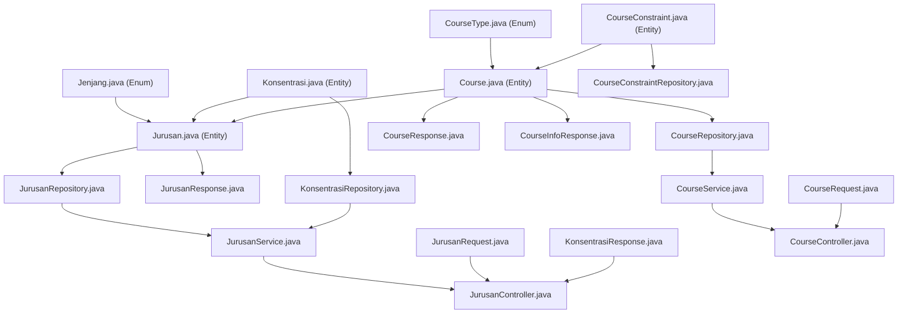

# Phase 3 — Academic Domain: `jurusan/` and `course/`

> **Reference:** [migration-roadmap.md](file:///c:/Users/Asus/Documents/Kuliah/Materi/Sem%208/Penelitian%20Ko%20Ray/Code/implementation-specs/migration-roadmap.md)
> **Reference:** [backend-spec.md](file:///c:/Users/Asus/Documents/Kuliah/Materi/Sem%208/Penelitian%20Ko%20Ray/Code/backup/backup%20random/backend-spec.md)
> **Depends on:** Phase 1 (config/, common/) + Phase 2 (auth/) — ✅ Complete
> **Goal:** Department/study program (jurusan) management with concentrations, and course management with constraints and faculty-based filtering.

---

## Table of Contents

1. [Current State](#1-current-state)
2. [Files Overview](#2-files-overview)
3. [Jurusan Package Implementation](#3-jurusan-package-implementation)
4. [Course Package Implementation](#4-course-package-implementation)
5. [Files to Delete](#5-files-to-delete)
6. [Verification Criteria](#6-verification-criteria)

---

## 1. Current State

Phase 1 and 2 are complete. The following infrastructure is in place:
- `SecurityConfig.java` — JWT stateless filter chain + `@EnableMethodSecurity`
- `JwtAuthenticationFilter.java` — Extracts JWT, stores `userId` in credentials, assigns `ROLE_ADMIN` or `ROLE_FACULTY_USER`
- `BaseCrudService.java` — Generic CRUD interface (`findAll`, `findById`, `create`, `update`, `delete`)
- `BaseSoftDeleteEntity.java` — `@MappedSuperclass` with `createdAt`, `updatedAt`, `deletedAt`
- `GlobalExceptionHandler.java` — Handles `ResourceNotFoundException`, `DuplicateResourceException`, `BadRequestException`, etc.
- `auth/` package — `User`, `UserRepository`, `AuthController`, `AuthService`, `UserController`, `UserService`
- `semester/` package — `Semester`, `SemesterRepository`, `SemesterController`, `SemesterService`

The `jurusan/` and `course/` packages do **not yet exist** and must be created from scratch.

---

## 2. Files Overview

### Action Summary (17 files total)

| # | File | Package | Action | Purpose |
|---|------|---------|--------|---------|
| 1 | `Jurusan.java` | `jurusan/` | **CREATE** | `@Entity` with soft delete |
| 2 | `Jenjang.java` | `jurusan/` | **CREATE** | Enum: `D3`, `S1`, `S2`, `S3` |
| 3 | `JurusanRepository.java` | `jurusan/` | **CREATE** | Spring Data JPA repository |
| 4 | `JurusanRequest.java` | `jurusan/` | **CREATE** | Create/update request DTO |
| 5 | `JurusanResponse.java` | `jurusan/` | **CREATE** | Response DTO |
| 6 | `JurusanService.java` | `jurusan/` | **CREATE** | Business logic with faculty filtering |
| 7 | `JurusanController.java` | `jurusan/` | **CREATE** | CRUD + konsentrasi sub-resource |
| 8 | `Konsentrasi.java` | `jurusan/konsentrasi/` | **CREATE** | `@Entity` with soft delete |
| 9 | `KonsentrasiRepository.java` | `jurusan/konsentrasi/` | **CREATE** | Spring Data JPA repository |
| 10 | `KonsentrasiResponse.java` | `jurusan/konsentrasi/` | **CREATE** | Response DTO |
| 11 | `Course.java` | `course/` | **CREATE** | `@Entity` with soft delete, unique `code` |
| 12 | `CourseType.java` | `course/` | **CREATE** | Enum: `Wajib`, `Pilihan` |
| 13 | `CourseRepository.java` | `course/` | **CREATE** | Spring Data JPA repository |
| 14 | `CourseRequest.java` | `course/` | **CREATE** | Create/update request DTO |
| 15 | `CourseResponse.java` | `course/` | **CREATE** | Response DTO with computed `color` |
| 16 | `CourseService.java` | `course/` | **CREATE** | Business logic |
| 17 | `CourseController.java` | `course/` | **CREATE** | CRUD + `/info`, `/by-jurusan` |
| 18 | `CourseInfoResponse.java` | `course/` | **CREATE** | Course info + activity summary DTO |
| 19 | `CourseConstraint.java` | `course/constraint/` | **CREATE** | `@Entity` (no soft delete, no timestamps) |
| 20 | `CourseConstraintRepository.java` | `course/constraint/` | **CREATE** | Spring Data JPA repository |

> [!NOTE]
> **20 files total** (the roadmap listed 17, but the detailed spec calls for 20 after including `CourseInfoResponse`, `CourseConstraint`, and `CourseConstraintRepository`).
> **No existing files need to be edited or deleted** in Phase 3. All files are brand new.

---

## 3. Jurusan Package Implementation

All paths are relative to `Code/new/timetabling-backend/src/main/java/com/timetablingapp/`.

---

### 3.1 `jurusan/Jenjang.java`

**Path:** `src/main/java/com/timetablingapp/jurusan/Jenjang.java`
**Action:** CREATE
**Purpose:** Enum representing the education level. Stored in DB as `ENUM('D3','S1','S2','S3')` with default `S1`.

```java
package com.timetablingapp.jurusan;

public enum Jenjang {
    D3,
    S1,
    S2,
    S3
}
```

---

### 3.2 `jurusan/Jurusan.java`

**Path:** `src/main/java/com/timetablingapp/jurusan/Jurusan.java`
**Action:** CREATE
**Purpose:** JPA entity mapping to the existing Laravel `jurusans` table. Uses soft delete.

**Database Schema (from Laravel migrations):**
```sql
-- 2020_09_02_092011_create_jurusans_table.php
CREATE TABLE jurusans (
    id INT UNSIGNED AUTO_INCREMENT PRIMARY KEY,
    name VARCHAR(255) NOT NULL,
    created_at TIMESTAMP NULL,
    updated_at TIMESTAMP NULL,
    deleted_at TIMESTAMP NULL
);

-- 2020_12_26_141217_add_faculty_column_jurusans_table.php
ALTER TABLE jurusans ADD faculty VARCHAR(255);
ALTER TABLE jurusans ADD jenjang ENUM('D3','S1','S2','S3') DEFAULT 'S1';

-- 2022_08_16_140135_update_prodi_color.php
ALTER TABLE jurusans ADD color INT;
```

```java
package com.timetablingapp.jurusan;

import com.timetablingapp.common.base.BaseSoftDeleteEntity;
import jakarta.persistence.*;
import jakarta.validation.constraints.NotBlank;
import lombok.AllArgsConstructor;
import lombok.Getter;
import lombok.NoArgsConstructor;
import lombok.Setter;
import org.hibernate.annotations.SQLDelete;
import org.hibernate.annotations.SQLRestriction;

@Entity
@Table(name = "jurusans")
@SQLDelete(sql = "UPDATE jurusans SET deleted_at = NOW() WHERE id = ?")
@SQLRestriction("deleted_at IS NULL")
@Getter
@Setter
@NoArgsConstructor
@AllArgsConstructor
public class Jurusan extends BaseSoftDeleteEntity {

    @Id
    @GeneratedValue(strategy = GenerationType.IDENTITY)
    private Integer id;

    @NotBlank
    @Column(nullable = false)
    private String name;

    @Column
    private String faculty;

    @Enumerated(EnumType.STRING)
    @Column(columnDefinition = "ENUM('D3','S1','S2','S3') DEFAULT 'S1'")
    private Jenjang jenjang;

    @Column
    private Integer color;
}
```

> [!IMPORTANT]
> **Design Decisions:**
> - `jenjang` uses `@Enumerated(EnumType.STRING)` because the DB column is MySQL `ENUM('D3','S1','S2','S3')` — stored as string values.
> - `color` is an `Integer` representing an HSL hue value (0–360). Used by `Course.getColor()` to compute display colors.
> - `faculty` is used for faculty-based filtering: admin users see all jurusans, faculty users only see jurusans in their faculty.

---

### 3.3 `jurusan/JurusanRepository.java`

**Path:** `src/main/java/com/timetablingapp/jurusan/JurusanRepository.java`
**Action:** CREATE
**Purpose:** Spring Data JPA repository for `Jurusan` entity with faculty filtering.

```java
package com.timetablingapp.jurusan;

import org.springframework.data.jpa.repository.JpaRepository;
import org.springframework.stereotype.Repository;

import java.util.List;

@Repository
public interface JurusanRepository extends JpaRepository<Jurusan, Integer> {

    /**
     * Find all jurusans belonging to a specific faculty.
     * Used for faculty-based filtering (non-admin users).
     * Mirrors Laravel: Jurusan::where(['faculty' => $faculty])->get()
     */
    List<Jurusan> findByFaculty(String faculty);

    /**
     * Find all jurusan IDs for a specific faculty.
     * Mirrors Laravel: Jurusan::jurusanIds()
     */
    List<Jurusan> findAllByFaculty(String faculty);
}
```

---

### 3.4 `jurusan/JurusanRequest.java`

**Path:** `src/main/java/com/timetablingapp/jurusan/JurusanRequest.java`
**Action:** CREATE
**Purpose:** DTO for create/update jurusan requests.

```java
package com.timetablingapp.jurusan;

import jakarta.validation.constraints.NotBlank;
import jakarta.validation.constraints.NotNull;
import lombok.AllArgsConstructor;
import lombok.Getter;
import lombok.NoArgsConstructor;
import lombok.Setter;

@Getter
@Setter
@NoArgsConstructor
@AllArgsConstructor
public class JurusanRequest {

    @NotBlank(message = "Jurusan name is required")
    private String name;

    private String faculty;

    @NotNull(message = "Jenjang is required")
    private Jenjang jenjang;

    private Integer color;
}
```

---

### 3.5 `jurusan/JurusanResponse.java`

**Path:** `src/main/java/com/timetablingapp/jurusan/JurusanResponse.java`
**Action:** CREATE
**Purpose:** DTO for jurusan data in API responses.

```java
package com.timetablingapp.jurusan;

import lombok.AllArgsConstructor;
import lombok.Builder;
import lombok.Getter;
import lombok.NoArgsConstructor;
import lombok.Setter;

@Getter
@Setter
@Builder
@NoArgsConstructor
@AllArgsConstructor
public class JurusanResponse {

    private Integer id;
    private String name;
    private String faculty;
    private Jenjang jenjang;
    private Integer color;

    /**
     * Factory method to convert a Jurusan entity to JurusanResponse.
     */
    public static JurusanResponse fromEntity(Jurusan jurusan) {
        return JurusanResponse.builder()
                .id(jurusan.getId())
                .name(jurusan.getName())
                .faculty(jurusan.getFaculty())
                .jenjang(jurusan.getJenjang())
                .color(jurusan.getColor())
                .build();
    }
}
```

---

### 3.6 `jurusan/JurusanService.java`

**Path:** `src/main/java/com/timetablingapp/jurusan/JurusanService.java`
**Action:** CREATE
**Purpose:** Business logic for jurusan CRUD with faculty-based filtering.

```java
package com.timetablingapp.jurusan;

import com.timetablingapp.common.base.BaseCrudService;
import com.timetablingapp.common.exception.ResourceNotFoundException;
import com.timetablingapp.jurusan.konsentrasi.KonsentrasiRepository;
import com.timetablingapp.jurusan.konsentrasi.KonsentrasiResponse;
import lombok.RequiredArgsConstructor;
import org.springframework.stereotype.Service;
import org.springframework.transaction.annotation.Transactional;

import java.util.List;

@Service
@RequiredArgsConstructor
public class JurusanService implements BaseCrudService<JurusanResponse, JurusanRequest, Integer> {

    private final JurusanRepository jurusanRepository;
    private final KonsentrasiRepository konsentrasiRepository;

    /**
     * Find all jurusans.
     * For admin users, returns all jurusans.
     * For faculty users, returns only jurusans in their faculty.
     *
     * Mirrors Laravel: Jurusan::getCurrent()
     *
     * @param faculty the faculty of the authenticated user (null for admin)
     */
    public List<JurusanResponse> findAllByFaculty(String faculty) {
        List<Jurusan> jurusans;
        if (faculty == null || faculty.isBlank()) {
            // Admin sees all
            jurusans = jurusanRepository.findAll();
        } else {
            // Faculty user sees only their faculty's jurusans
            jurusans = jurusanRepository.findByFaculty(faculty);
        }
        return jurusans.stream()
                .map(JurusanResponse::fromEntity)
                .toList();
    }

    /**
     * Get jurusan IDs for the authenticated user's faculty.
     * Admin gets all IDs, faculty user gets only their faculty's IDs.
     *
     * Mirrors Laravel: Jurusan::jurusanIds()
     */
    public List<Integer> getJurusanIds(String faculty) {
        List<Jurusan> jurusans;
        if (faculty == null || faculty.isBlank()) {
            jurusans = jurusanRepository.findAll();
        } else {
            jurusans = jurusanRepository.findByFaculty(faculty);
        }
        return jurusans.stream()
                .map(Jurusan::getId)
                .toList();
    }

    @Override
    public List<JurusanResponse> findAll() {
        return jurusanRepository.findAll().stream()
                .map(JurusanResponse::fromEntity)
                .toList();
    }

    @Override
    public JurusanResponse findById(Integer id) {
        Jurusan jurusan = jurusanRepository.findById(id)
                .orElseThrow(() -> new ResourceNotFoundException("Jurusan", "id", id));
        return JurusanResponse.fromEntity(jurusan);
    }

    @Override
    @Transactional
    public JurusanResponse create(JurusanRequest request) {
        Jurusan jurusan = new Jurusan();
        jurusan.setName(request.getName());
        jurusan.setFaculty(request.getFaculty());
        jurusan.setJenjang(request.getJenjang());
        jurusan.setColor(request.getColor());

        Jurusan saved = jurusanRepository.save(jurusan);
        return JurusanResponse.fromEntity(saved);
    }

    @Override
    @Transactional
    public JurusanResponse update(Integer id, JurusanRequest request) {
        Jurusan jurusan = jurusanRepository.findById(id)
                .orElseThrow(() -> new ResourceNotFoundException("Jurusan", "id", id));

        jurusan.setName(request.getName());
        jurusan.setFaculty(request.getFaculty());
        jurusan.setJenjang(request.getJenjang());
        jurusan.setColor(request.getColor());

        Jurusan saved = jurusanRepository.save(jurusan);
        return JurusanResponse.fromEntity(saved);
    }

    @Override
    @Transactional
    public void delete(Integer id) {
        Jurusan jurusan = jurusanRepository.findById(id)
                .orElseThrow(() -> new ResourceNotFoundException("Jurusan", "id", id));
        jurusanRepository.delete(jurusan);
    }

    /**
     * Get concentrations for a specific jurusan.
     * Mirrors Laravel: CourseController.getKonsentrasiByJurusan($id)
     */
    public List<KonsentrasiResponse> getKonsentrasiByJurusanId(Integer jurusanId) {
        // Verify jurusan exists
        jurusanRepository.findById(jurusanId)
                .orElseThrow(() -> new ResourceNotFoundException("Jurusan", "id", jurusanId));

        return konsentrasiRepository.findByJurusanId(jurusanId).stream()
                .map(KonsentrasiResponse::fromEntity)
                .toList();
    }
}
```

> [!IMPORTANT]
> **Faculty-Based Filtering:**
> The `findAllByFaculty(String faculty)` method mirrors the Laravel `Jurusan::getCurrent()` method:
> - If the user's `faculty` is null or empty (admin), return **all** jurusans
> - If the user has a faculty value, return only jurusans with matching `faculty`
>
> The `JurusanController` extracts the user's faculty from the JWT token via `SecurityContextHolder`.

---

### 3.7 `jurusan/JurusanController.java`

**Path:** `src/main/java/com/timetablingapp/jurusan/JurusanController.java`
**Action:** CREATE
**Purpose:** REST controller for jurusan CRUD + konsentrasi sub-resource endpoint.

```java
package com.timetablingapp.jurusan;

import com.timetablingapp.common.dto.MessageResponse;
import com.timetablingapp.jurusan.konsentrasi.KonsentrasiResponse;
import jakarta.validation.Valid;
import lombok.RequiredArgsConstructor;
import org.springframework.http.HttpStatus;
import org.springframework.http.ResponseEntity;
import org.springframework.security.access.prepost.PreAuthorize;
import org.springframework.security.core.Authentication;
import org.springframework.security.core.context.SecurityContextHolder;
import org.springframework.web.bind.annotation.*;

import java.util.List;

@RestController
@RequestMapping("/api/jurusans")
@RequiredArgsConstructor
public class JurusanController {

    private final JurusanService jurusanService;

    /**
     * GET /api/jurusans — List all jurusans (filtered by faculty for non-admin users)
     */
    @GetMapping
    public ResponseEntity<List<JurusanResponse>> getAll() {
        String faculty = getCurrentUserFaculty();
        return ResponseEntity.ok(jurusanService.findAllByFaculty(faculty));
    }

    /**
     * GET /api/jurusans/{id} — Get jurusan by ID
     */
    @GetMapping("/{id}")
    public ResponseEntity<JurusanResponse> getById(@PathVariable Integer id) {
        return ResponseEntity.ok(jurusanService.findById(id));
    }

    /**
     * POST /api/jurusans — Create jurusan (ADMIN only)
     */
    @PostMapping
    @PreAuthorize("hasRole('ADMIN')")
    public ResponseEntity<JurusanResponse> create(@Valid @RequestBody JurusanRequest request) {
        JurusanResponse response = jurusanService.create(request);
        return ResponseEntity.status(HttpStatus.CREATED).body(response);
    }

    /**
     * PUT /api/jurusans/{id} — Update jurusan (ADMIN only)
     */
    @PutMapping("/{id}")
    @PreAuthorize("hasRole('ADMIN')")
    public ResponseEntity<JurusanResponse> update(
            @PathVariable Integer id,
            @Valid @RequestBody JurusanRequest request) {
        return ResponseEntity.ok(jurusanService.update(id, request));
    }

    /**
     * DELETE /api/jurusans/{id} — Delete jurusan (ADMIN only)
     */
    @DeleteMapping("/{id}")
    @PreAuthorize("hasRole('ADMIN')")
    public ResponseEntity<MessageResponse> delete(@PathVariable Integer id) {
        jurusanService.delete(id);
        return ResponseEntity.ok(MessageResponse.success("Jurusan deleted successfully"));
    }

    /**
     * GET /api/jurusans/{jurusanId}/konsentrasi — Get concentrations for a jurusan
     */
    @GetMapping("/{jurusanId}/konsentrasi")
    public ResponseEntity<List<KonsentrasiResponse>> getKonsentrasi(
            @PathVariable Integer jurusanId) {
        return ResponseEntity.ok(jurusanService.getKonsentrasiByJurusanId(jurusanId));
    }

    /**
     * Extracts the faculty of the currently authenticated user from the JWT.
     * Returns null for admin users (faculty is null/empty).
     */
    private String getCurrentUserFaculty() {
        Authentication auth = SecurityContextHolder.getContext().getAuthentication();
        if (auth != null && auth.getDetails() instanceof String faculty) {
            return faculty;
        }
        return null;
    }
}
```

> [!IMPORTANT]
> **How `getCurrentUserFaculty()` works:**
> The `JwtAuthenticationFilter` (Phase 1) stores the user's `faculty` in the `details` field of the `UsernamePasswordAuthenticationToken`. The controller extracts it via `auth.getDetails()`.
> - For admin users, `details` will be `null` or empty → `findAllByFaculty(null)` returns all jurusans.
> - For faculty users, `details` will be the faculty string → filtering applies.
>
> **If `JwtAuthenticationFilter` doesn't currently store faculty in `details`**, we need to verify and potentially update it. See [Appendix C](#appendix-c-jwtauthenticationfilter-verification) at the end of this document.

---

### 3.8 `jurusan/konsentrasi/Konsentrasi.java`

**Path:** `src/main/java/com/timetablingapp/jurusan/konsentrasi/Konsentrasi.java`
**Action:** CREATE
**Purpose:** JPA entity mapping to the existing Laravel `konsentrasi` table. Uses soft delete.

**Database Schema (from Laravel migrations):**
```sql
-- 2021_03_17_121418_create_konsentrasi_table.php
CREATE TABLE konsentrasi (
    id INT UNSIGNED AUTO_INCREMENT PRIMARY KEY,
    jurusan_id INT UNSIGNED NOT NULL,
    konsentrasi TEXT NOT NULL,
    created_at TIMESTAMP NULL,
    updated_at TIMESTAMP NULL,
    deleted_at TIMESTAMP NULL,
    FOREIGN KEY (jurusan_id) REFERENCES jurusans(id)
);
```

```java
package com.timetablingapp.jurusan.konsentrasi;

import com.timetablingapp.common.base.BaseSoftDeleteEntity;
import com.timetablingapp.jurusan.Jurusan;
import jakarta.persistence.*;
import jakarta.validation.constraints.NotBlank;
import lombok.AllArgsConstructor;
import lombok.Getter;
import lombok.NoArgsConstructor;
import lombok.Setter;
import org.hibernate.annotations.SQLDelete;
import org.hibernate.annotations.SQLRestriction;

@Entity
@Table(name = "konsentrasi")
@SQLDelete(sql = "UPDATE konsentrasi SET deleted_at = NOW() WHERE id = ?")
@SQLRestriction("deleted_at IS NULL")
@Getter
@Setter
@NoArgsConstructor
@AllArgsConstructor
public class Konsentrasi extends BaseSoftDeleteEntity {

    @Id
    @GeneratedValue(strategy = GenerationType.IDENTITY)
    private Integer id;

    @ManyToOne(fetch = FetchType.LAZY)
    @JoinColumn(name = "jurusan_id", nullable = false)
    private Jurusan jurusan;

    @NotBlank
    @Column(nullable = false, columnDefinition = "TEXT")
    private String konsentrasi;
}
```

---

### 3.9 `jurusan/konsentrasi/KonsentrasiRepository.java`

**Path:** `src/main/java/com/timetablingapp/jurusan/konsentrasi/KonsentrasiRepository.java`
**Action:** CREATE
**Purpose:** Spring Data JPA repository for `Konsentrasi` entity.

```java
package com.timetablingapp.jurusan.konsentrasi;

import org.springframework.data.jpa.repository.JpaRepository;
import org.springframework.stereotype.Repository;

import java.util.List;

@Repository
public interface KonsentrasiRepository extends JpaRepository<Konsentrasi, Integer> {

    /**
     * Find all concentrations for a specific jurusan.
     * Mirrors Laravel: Konsentrasi::where('jurusan_id', $id)->get()
     */
    List<Konsentrasi> findByJurusanId(Integer jurusanId);
}
```

---

### 3.10 `jurusan/konsentrasi/KonsentrasiResponse.java`

**Path:** `src/main/java/com/timetablingapp/jurusan/konsentrasi/KonsentrasiResponse.java`
**Action:** CREATE
**Purpose:** DTO for konsentrasi data in API responses.

```java
package com.timetablingapp.jurusan.konsentrasi;

import lombok.AllArgsConstructor;
import lombok.Builder;
import lombok.Getter;
import lombok.NoArgsConstructor;
import lombok.Setter;

@Getter
@Setter
@Builder
@NoArgsConstructor
@AllArgsConstructor
public class KonsentrasiResponse {

    private Integer id;
    private Integer jurusanId;
    private String konsentrasi;

    /**
     * Factory method to convert a Konsentrasi entity to KonsentrasiResponse.
     */
    public static KonsentrasiResponse fromEntity(Konsentrasi entity) {
        return KonsentrasiResponse.builder()
                .id(entity.getId())
                .jurusanId(entity.getJurusan().getId())
                .konsentrasi(entity.getKonsentrasi())
                .build();
    }
}
```

---

## 4. Course Package Implementation

All paths are relative to `Code/new/timetabling-backend/src/main/java/com/timetablingapp/`.

---

### 4.1 `course/CourseType.java`

**Path:** `src/main/java/com/timetablingapp/course/CourseType.java`
**Action:** CREATE
**Purpose:** Enum representing the course type. The DB column is `VARCHAR` with default `"Pilihan"`.

```java
package com.timetablingapp.course;

/**
 * Course type enum.
 * Values match the database strings exactly.
 * Laravel default: "Pilihan"
 */
public enum CourseType {
    Wajib,
    Pilihan
}
```

> [!NOTE]
> The Laravel migration uses `$table->string('type')->default("Pilihan")` which is a plain VARCHAR column storing the string `"Wajib"` or `"Pilihan"`. The enum values use PascalCase to exactly match the database values.

---

### 4.2 `course/Course.java`

**Path:** `src/main/java/com/timetablingapp/course/Course.java`
**Action:** CREATE
**Purpose:** JPA entity mapping to the existing Laravel `courses` table. Uses soft delete.

**Database Schema (combined from Laravel migrations):**
```sql
-- 2020_08_19_025611_create_courses_table.php
CREATE TABLE courses (
    id INT UNSIGNED AUTO_INCREMENT PRIMARY KEY,
    code VARCHAR(12) NOT NULL INDEX,
    name VARCHAR(255) NOT NULL,
    created_at TIMESTAMP NULL,
    updated_at TIMESTAMP NULL,
    deleted_at TIMESTAMP NULL
);

-- 2021_01_17_170752_add_bentrok_columns_on_course_table.php
ALTER TABLE courses ADD type VARCHAR(255) DEFAULT 'Pilihan';
ALTER TABLE courses ADD tingkat INT NULL;
ALTER TABLE courses ADD konsentrasi VARCHAR(255) NULL;

-- 2020_09_02_092011_create_jurusans_table.php
ALTER TABLE courses ADD jurusan_id INT UNSIGNED;
ALTER TABLE courses ADD FOREIGN KEY (jurusan_id) REFERENCES jurusans(id);
```

```java
package com.timetablingapp.course;

import com.timetablingapp.common.base.BaseSoftDeleteEntity;
import com.timetablingapp.jurusan.Jurusan;
import jakarta.persistence.*;
import jakarta.validation.constraints.NotBlank;
import lombok.AllArgsConstructor;
import lombok.Getter;
import lombok.NoArgsConstructor;
import lombok.Setter;
import org.hibernate.annotations.SQLDelete;
import org.hibernate.annotations.SQLRestriction;

@Entity
@Table(name = "courses")
@SQLDelete(sql = "UPDATE courses SET deleted_at = NOW() WHERE id = ?")
@SQLRestriction("deleted_at IS NULL")
@Getter
@Setter
@NoArgsConstructor
@AllArgsConstructor
public class Course extends BaseSoftDeleteEntity {

    @Id
    @GeneratedValue(strategy = GenerationType.IDENTITY)
    private Integer id;

    @NotBlank
    @Column(nullable = false, length = 12, unique = true)
    private String code;

    @NotBlank
    @Column(nullable = false)
    private String name;

    @Enumerated(EnumType.STRING)
    @Column
    private CourseType type;

    @Column
    private Integer tingkat;

    @Column
    private String konsentrasi;

    @ManyToOne(fetch = FetchType.LAZY)
    @JoinColumn(name = "jurusan_id")
    private Jurusan jurusan;

    /**
     * Computes the display color as an HSL string based on jurusan's hue and course tingkat.
     *
     * Mirrors Laravel: Course::getColorAttribute()
     *
     * Logic:
     * - t = floor(tingkat / 2)
     * - t=0 → hsl(color,100%,95%)  (lightest)
     * - t=1 → hsl(color,100%,80%)
     * - t=2 → hsl(color,100%,65%)
     * - t=3 → hsl(color,100%,50%)  (darkest)
     */
    @Transient
    public String getColor() {
        if (jurusan == null || jurusan.getColor() == null || tingkat == null) {
            return "";
        }

        int hue = jurusan.getColor();
        int t = (int) Math.floor(tingkat / 2.0);

        return switch (t) {
            case 0 -> "hsl(" + hue + ",100%,95%)";
            case 1 -> "hsl(" + hue + ",100%,80%)";
            case 2 -> "hsl(" + hue + ",100%,65%)";
            case 3 -> "hsl(" + hue + ",100%,50%)";
            default -> "";
        };
    }

    /**
     * Computes a priority value based on jenjang and time slot.
     * Used by the genetic algorithm for slot prioritization.
     *
     * Mirrors Laravel: Course::getPriorityValue($day, $hour, $jenjang)
     *
     * S1: priority if Mon-Fri (1-5) and 7:00-17:00
     * Others: priority if Fri+ (>=5) and 7:00-21:00
     */
    @Transient
    public int getPriorityValue(int day, int hour, String jenjang) {
        if ("S1".equals(jenjang)) {
            if (day >= 1 && day <= 5 && hour >= 7 && hour <= 17) {
                return 1;
            }
        } else {
            if (day >= 5 && hour >= 7 && hour <= 21) {
                return 1;
            }
        }
        return 0;
    }
}
```

> [!IMPORTANT]
> **Design Decisions:**
> - `code` is `unique = true` and `length = 12` to match the Laravel `$table->string('code', 12)->index()`.
> - `type` uses `@Enumerated(EnumType.STRING)` because the DB stores `"Wajib"` / `"Pilihan"` as varchar strings.
> - `getColor()` is `@Transient` — computed from `jurusan.color` and `tingkat`, never stored.
> - `getPriorityValue()` is `@Transient` — used by the genetic algorithm (Phase 8) for slot prioritization.
> - The `jurusan` relationship uses `FetchType.LAZY` for performance.

---

### 4.3 `course/CourseRepository.java`

**Path:** `src/main/java/com/timetablingapp/course/CourseRepository.java`
**Action:** CREATE
**Purpose:** Spring Data JPA repository for `Course` entity.

```java
package com.timetablingapp.course;

import org.springframework.data.jpa.repository.JpaRepository;
import org.springframework.stereotype.Repository;

import java.util.List;
import java.util.Optional;

@Repository
public interface CourseRepository extends JpaRepository<Course, Integer> {

    /**
     * Find a course by its unique code.
     * Mirrors Laravel: Course::where('code', $code)->first()
     */
    Optional<Course> findByCode(String code);

    /**
     * Check if a course code already exists.
     * Used for import duplicate detection.
     * Mirrors Laravel: CourseRepository.contains($code)
     */
    boolean existsByCode(String code);

    /**
     * Find all courses belonging to a specific jurusan.
     * Mirrors Laravel: Course::where("jurusan_id", $jurusanId)->get()
     */
    List<Course> findByJurusanId(Integer jurusanId);

    /**
     * Find all courses belonging to jurusans in the given list.
     * Mirrors Laravel: Course::whereIn("jurusan_id", Jurusan::jurusanIds())->get()
     */
    List<Course> findByJurusanIdIn(List<Integer> jurusanIds);
}
```

---

### 4.4 `course/CourseRequest.java`

**Path:** `src/main/java/com/timetablingapp/course/CourseRequest.java`
**Action:** CREATE
**Purpose:** DTO for create/update course requests.

```java
package com.timetablingapp.course;

import jakarta.validation.constraints.NotBlank;
import jakarta.validation.constraints.NotNull;
import lombok.AllArgsConstructor;
import lombok.Getter;
import lombok.NoArgsConstructor;
import lombok.Setter;

@Getter
@Setter
@NoArgsConstructor
@AllArgsConstructor
public class CourseRequest {

    @NotBlank(message = "Course code is required")
    private String code;

    @NotBlank(message = "Course name is required")
    private String name;

    @NotNull(message = "Course type is required")
    private CourseType type;

    private Integer tingkat;

    private String konsentrasi;

    @NotNull(message = "Jurusan ID is required")
    private Integer jurusanId;
}
```

---

### 4.5 `course/CourseResponse.java`

**Path:** `src/main/java/com/timetablingapp/course/CourseResponse.java`
**Action:** CREATE
**Purpose:** DTO for course data in API responses. Includes computed `color` field.

```java
package com.timetablingapp.course;

import com.timetablingapp.jurusan.JurusanResponse;
import lombok.AllArgsConstructor;
import lombok.Builder;
import lombok.Getter;
import lombok.NoArgsConstructor;
import lombok.Setter;

@Getter
@Setter
@Builder
@NoArgsConstructor
@AllArgsConstructor
public class CourseResponse {

    private Integer id;
    private String code;
    private String name;
    private CourseType type;
    private Integer tingkat;
    private String konsentrasi;
    private Integer jurusanId;
    private JurusanResponse jurusan;
    private String color;

    /**
     * Factory method to convert a Course entity to CourseResponse.
     * Includes the computed color and jurusan details.
     */
    public static CourseResponse fromEntity(Course course) {
        CourseResponse.CourseResponseBuilder builder = CourseResponse.builder()
                .id(course.getId())
                .code(course.getCode())
                .name(course.getName())
                .type(course.getType())
                .tingkat(course.getTingkat())
                .konsentrasi(course.getKonsentrasi())
                .color(course.getColor());

        if (course.getJurusan() != null) {
            builder.jurusanId(course.getJurusan().getId())
                   .jurusan(JurusanResponse.fromEntity(course.getJurusan()));
        }

        return builder.build();
    }
}
```

> [!NOTE]
> **Color Computation:**
> The `color` field in the response is computed by `Course.getColor()` which derives an HSL string from `jurusan.color` (hue) and `course.tingkat` (lightness). This mirrors the Laravel `$appends = ['color']` accessor pattern.

---

### 4.6 `course/CourseInfoResponse.java`

**Path:** `src/main/java/com/timetablingapp/course/CourseInfoResponse.java`
**Action:** CREATE
**Purpose:** DTO for `GET /api/courses/{id}/info` — returns course info with its jurusan details. Activity summary will be added in Phase 5 when the `Activity` entity exists.

```java
package com.timetablingapp.course;

import com.timetablingapp.jurusan.JurusanResponse;
import lombok.AllArgsConstructor;
import lombok.Builder;
import lombok.Getter;
import lombok.NoArgsConstructor;
import lombok.Setter;

@Getter
@Setter
@Builder
@NoArgsConstructor
@AllArgsConstructor
public class CourseInfoResponse {

    private Integer id;
    private String code;
    private String name;
    private CourseType type;
    private Integer tingkat;
    private String konsentrasi;
    private JurusanResponse jurusan;
    private String color;

    // TODO: Phase 5 — Add activity summary fields:
    // private List<ActivitySummary> activities;

    /**
     * Factory method from Course entity.
     */
    public static CourseInfoResponse fromEntity(Course course) {
        CourseInfoResponse.CourseInfoResponseBuilder builder = CourseInfoResponse.builder()
                .id(course.getId())
                .code(course.getCode())
                .name(course.getName())
                .type(course.getType())
                .tingkat(course.getTingkat())
                .konsentrasi(course.getKonsentrasi())
                .color(course.getColor());

        if (course.getJurusan() != null) {
            builder.jurusan(JurusanResponse.fromEntity(course.getJurusan()));
        }

        return builder.build();
    }
}
```

---

### 4.7 `course/CourseService.java`

**Path:** `src/main/java/com/timetablingapp/course/CourseService.java`
**Action:** CREATE
**Purpose:** Business logic for course CRUD operations.

```java
package com.timetablingapp.course;

import com.timetablingapp.common.base.BaseCrudService;
import com.timetablingapp.common.exception.DuplicateResourceException;
import com.timetablingapp.common.exception.ResourceNotFoundException;
import com.timetablingapp.jurusan.Jurusan;
import com.timetablingapp.jurusan.JurusanRepository;
import com.timetablingapp.jurusan.JurusanService;
import lombok.RequiredArgsConstructor;
import org.springframework.stereotype.Service;
import org.springframework.transaction.annotation.Transactional;

import java.util.List;

@Service
@RequiredArgsConstructor
public class CourseService implements BaseCrudService<CourseResponse, CourseRequest, Integer> {

    private final CourseRepository courseRepository;
    private final JurusanRepository jurusanRepository;
    private final JurusanService jurusanService;

    @Override
    public List<CourseResponse> findAll() {
        return courseRepository.findAll().stream()
                .map(CourseResponse::fromEntity)
                .toList();
    }

    /**
     * Find all courses filtered by the authenticated user's faculty.
     * Admin sees all courses, faculty user sees only courses in their faculty's jurusans.
     *
     * Mirrors Laravel: Course::whereIn("jurusan_id", Jurusan::jurusanIds())->with(['jurusan'])->get()
     */
    public List<CourseResponse> findAllByFaculty(String faculty) {
        List<Integer> jurusanIds = jurusanService.getJurusanIds(faculty);
        return courseRepository.findByJurusanIdIn(jurusanIds).stream()
                .map(CourseResponse::fromEntity)
                .toList();
    }

    @Override
    public CourseResponse findById(Integer id) {
        Course course = courseRepository.findById(id)
                .orElseThrow(() -> new ResourceNotFoundException("Course", "id", id));
        return CourseResponse.fromEntity(course);
    }

    @Override
    @Transactional
    public CourseResponse create(CourseRequest request) {
        // Check for duplicate course code
        if (courseRepository.existsByCode(request.getCode())) {
            throw new DuplicateResourceException("Course", "code", request.getCode());
        }

        Jurusan jurusan = jurusanRepository.findById(request.getJurusanId())
                .orElseThrow(() -> new ResourceNotFoundException("Jurusan", "id", request.getJurusanId()));

        Course course = new Course();
        course.setCode(request.getCode());
        course.setName(request.getName());
        course.setType(request.getType());
        course.setTingkat(request.getTingkat());
        course.setKonsentrasi(request.getKonsentrasi());
        course.setJurusan(jurusan);

        Course saved = courseRepository.save(course);
        return CourseResponse.fromEntity(saved);
    }

    @Override
    @Transactional
    public CourseResponse update(Integer id, CourseRequest request) {
        Course course = courseRepository.findById(id)
                .orElseThrow(() -> new ResourceNotFoundException("Course", "id", id));

        // Check for duplicate code if changed
        if (!course.getCode().equals(request.getCode())
                && courseRepository.existsByCode(request.getCode())) {
            throw new DuplicateResourceException("Course", "code", request.getCode());
        }

        Jurusan jurusan = jurusanRepository.findById(request.getJurusanId())
                .orElseThrow(() -> new ResourceNotFoundException("Jurusan", "id", request.getJurusanId()));

        course.setCode(request.getCode());
        course.setName(request.getName());
        course.setType(request.getType());
        course.setTingkat(request.getTingkat());
        course.setKonsentrasi(request.getKonsentrasi());
        course.setJurusan(jurusan);

        Course saved = courseRepository.save(course);
        return CourseResponse.fromEntity(saved);
    }

    @Override
    @Transactional
    public void delete(Integer id) {
        Course course = courseRepository.findById(id)
                .orElseThrow(() -> new ResourceNotFoundException("Course", "id", id));

        // TODO: Phase 5 — Check if course is used in activities before deletion
        // Mirrors Laravel: Activity::where('course_code', $course->code)->get()
        // If activities exist, throw BadRequestException

        courseRepository.delete(course);
    }

    /**
     * Find all courses belonging to a specific jurusan.
     * Mirrors Laravel: CourseController.getCourses($jurusanId)
     */
    public List<CourseResponse> findByJurusanId(Integer jurusanId) {
        // Verify jurusan exists
        jurusanRepository.findById(jurusanId)
                .orElseThrow(() -> new ResourceNotFoundException("Jurusan", "id", jurusanId));

        return courseRepository.findByJurusanId(jurusanId).stream()
                .map(CourseResponse::fromEntity)
                .toList();
    }

    /**
     * Get course info with jurusan details.
     * Mirrors Laravel: CourseController.getInfo($courseCode)
     *
     * NOTE: Activity summary will be added in Phase 5.
     */
    public CourseInfoResponse getCourseInfo(Integer id) {
        Course course = courseRepository.findById(id)
                .orElseThrow(() -> new ResourceNotFoundException("Course", "id", id));

        return CourseInfoResponse.fromEntity(course);
    }
}
```

> [!NOTE]
> **Deferred Implementation:**
> - The `delete()` method has a TODO for Phase 5 to check if the course is used in activities before allowing deletion (mirrors Laravel's safety check: `Activity::where('course_code', $course->code)`).
> - The `getCourseInfo()` method returns basic course info now. Activity summary fields will be added in Phase 5 when `Activity` entity is available.

---

### 4.8 `course/CourseController.java`

**Path:** `src/main/java/com/timetablingapp/course/CourseController.java`
**Action:** CREATE
**Purpose:** REST controller for course CRUD + `/info` and `/by-jurusan` endpoints.

```java
package com.timetablingapp.course;

import com.timetablingapp.common.dto.MessageResponse;
import jakarta.validation.Valid;
import lombok.RequiredArgsConstructor;
import org.springframework.http.HttpStatus;
import org.springframework.http.ResponseEntity;
import org.springframework.security.core.Authentication;
import org.springframework.security.core.context.SecurityContextHolder;
import org.springframework.web.bind.annotation.*;

import java.util.List;

@RestController
@RequestMapping("/api/courses")
@RequiredArgsConstructor
public class CourseController {

    private final CourseService courseService;

    /**
     * GET /api/courses — List all courses (filtered by faculty)
     */
    @GetMapping
    public ResponseEntity<List<CourseResponse>> getAll() {
        String faculty = getCurrentUserFaculty();
        return ResponseEntity.ok(courseService.findAllByFaculty(faculty));
    }

    /**
     * GET /api/courses/{id} — Get course by ID
     */
    @GetMapping("/{id}")
    public ResponseEntity<CourseResponse> getById(@PathVariable Integer id) {
        return ResponseEntity.ok(courseService.findById(id));
    }

    /**
     * POST /api/courses — Create course (any authenticated user)
     */
    @PostMapping
    public ResponseEntity<CourseResponse> create(@Valid @RequestBody CourseRequest request) {
        CourseResponse response = courseService.create(request);
        return ResponseEntity.status(HttpStatus.CREATED).body(response);
    }

    /**
     * PUT /api/courses/{id} — Update course (any authenticated user)
     */
    @PutMapping("/{id}")
    public ResponseEntity<CourseResponse> update(
            @PathVariable Integer id,
            @Valid @RequestBody CourseRequest request) {
        return ResponseEntity.ok(courseService.update(id, request));
    }

    /**
     * DELETE /api/courses/{id} — Delete course (any authenticated user)
     */
    @DeleteMapping("/{id}")
    public ResponseEntity<MessageResponse> delete(@PathVariable Integer id) {
        courseService.delete(id);
        return ResponseEntity.ok(MessageResponse.success("Course deleted successfully"));
    }

    /**
     * GET /api/courses/{id}/info — Get course info with jurusan details
     * Mirrors Laravel: CourseController.getInfo($courseCode)
     */
    @GetMapping("/{id}/info")
    public ResponseEntity<CourseInfoResponse> getInfo(@PathVariable Integer id) {
        return ResponseEntity.ok(courseService.getCourseInfo(id));
    }

    /**
     * GET /api/courses/by-jurusan/{id} — Get courses by jurusan ID
     * Mirrors Laravel: CourseController.getCourses($jurusanId)
     */
    @GetMapping("/by-jurusan/{id}")
    public ResponseEntity<List<CourseResponse>> getByJurusan(@PathVariable Integer id) {
        return ResponseEntity.ok(courseService.findByJurusanId(id));
    }

    // NOTE: Excel import/export endpoints will be added in Phase 9
    // GET  /api/courses/export  → Download courses as Excel
    // POST /api/courses/import  → Upload courses from Excel

    /**
     * Extracts the faculty of the currently authenticated user from the JWT.
     */
    private String getCurrentUserFaculty() {
        Authentication auth = SecurityContextHolder.getContext().getAuthentication();
        if (auth != null && auth.getDetails() instanceof String faculty) {
            return faculty;
        }
        return null;
    }
}
```

> [!NOTE]
> **Route Mapping to Laravel:**
> | Spring Boot | Laravel | Notes |
> |-------------|---------|-------|
> | `GET /api/courses` | `CourseController@index` | List with faculty filter |
> | `GET /api/courses/{id}` | `CourseAPIController@show` | Get by ID |
> | `POST /api/courses` | `CourseController@store` | Create |
> | `PUT /api/courses/{id}` | `CourseController@update` | Update |
> | `DELETE /api/courses/{id}` | `CourseController@destroy` | Delete (soft) |
> | `GET /api/courses/{id}/info` | `CourseController@getInfo` | Course info with jurusan |
> | `GET /api/courses/by-jurusan/{id}` | `CourseController@getCourses` | By jurusan |
> | `GET /api/courses/export` | Phase 9 | Excel download |
> | `POST /api/courses/import` | Phase 9 | Excel upload |

---

### 4.9 `course/constraint/CourseConstraint.java`

**Path:** `src/main/java/com/timetablingapp/course/constraint/CourseConstraint.java`
**Action:** CREATE
**Purpose:** JPA entity mapping to the existing Laravel `course_constraints` table. **No soft delete, no timestamps**.

**Database Schema (from Laravel migrations):**
```sql
-- 2023_03_12_160505_create_course_constraints_table.php
CREATE TABLE course_constraints (
    id INT UNSIGNED AUTO_INCREMENT PRIMARY KEY,
    course_id INT UNSIGNED NOT NULL,
    with_course_id INT UNSIGNED NULL,
    with_semester INT UNSIGNED NULL,
    FOREIGN KEY (course_id) REFERENCES courses(id),
    FOREIGN KEY (with_course_id) REFERENCES courses(id)
);
```

```java
package com.timetablingapp.course.constraint;

import com.timetablingapp.course.Course;
import jakarta.persistence.*;
import lombok.AllArgsConstructor;
import lombok.Getter;
import lombok.NoArgsConstructor;
import lombok.Setter;

@Entity
@Table(name = "course_constraints")
@Getter
@Setter
@NoArgsConstructor
@AllArgsConstructor
public class CourseConstraint {

    @Id
    @GeneratedValue(strategy = GenerationType.IDENTITY)
    private Integer id;

    @ManyToOne(fetch = FetchType.LAZY)
    @JoinColumn(name = "course_id", nullable = false)
    private Course course;

    @ManyToOne(fetch = FetchType.LAZY)
    @JoinColumn(name = "with_course_id")
    private Course withCourse;

    @Column(name = "with_semester")
    private Integer withSemester;
}
```

> [!IMPORTANT]
> **Design Decisions:**
> - **No soft delete** — the `course_constraints` table has no `deleted_at` column. Laravel's `CourseConstraint` model has `$timestamps = false`.
> - **No timestamps** — the table has no `created_at` or `updated_at` columns, so this entity does NOT extend `BaseEntity` or `BaseSoftDeleteEntity`.
> - **Two types of constraints:**
>   - **Course constraint:** `with_course_id` is set, `with_semester` is null → two courses cannot overlap
>   - **Semester constraint:** `with_semester` is set, `with_course_id` is null → course cannot be in specific semester

---

### 4.10 `course/constraint/CourseConstraintRepository.java`

**Path:** `src/main/java/com/timetablingapp/course/constraint/CourseConstraintRepository.java`
**Action:** CREATE
**Purpose:** Spring Data JPA repository for `CourseConstraint` entity.

```java
package com.timetablingapp.course.constraint;

import org.springframework.data.jpa.repository.JpaRepository;
import org.springframework.stereotype.Repository;

import java.util.List;

@Repository
public interface CourseConstraintRepository extends JpaRepository<CourseConstraint, Integer> {

    /**
     * Find all constraints where this course is the primary course.
     * Mirrors Laravel: CourseConstraint::where('course_id', $courseId)->get()
     */
    List<CourseConstraint> findByCourseId(Integer courseId);

    /**
     * Find all constraints where this course is the "with" course.
     * Mirrors Laravel: CourseConstraint::where('with_course_id', $courseId)->get()
     */
    List<CourseConstraint> findByWithCourseId(Integer courseId);

    /**
     * Find course constraints (not semester constraints) for a course.
     * Mirrors Laravel: CourseConstraint::where('course_id', $courseId)->whereNull('with_semester')->get()
     */
    List<CourseConstraint> findByCourseIdAndWithSemesterIsNull(Integer courseId);

    /**
     * Find constraints where this course is the "with_course_id" (reverse lookup).
     * Mirrors Laravel: CourseConstraint::where('with_course_id', $courseId)->whereNull('with_semester')->get()
     */
    List<CourseConstraint> findByWithCourseIdAndWithSemesterIsNull(Integer withCourseId);

    /**
     * Find semester constraints for a course.
     * Mirrors Laravel: CourseConstraint::where('course_id', $courseId)->whereNull('with_course_id')->get()
     */
    List<CourseConstraint> findByCourseIdAndWithCourseIsNull(Integer courseId);

    /**
     * Delete all constraints where the course is the primary course.
     * Mirrors Laravel: CourseConstraint::where('course_id', $thisCourseId)->delete()
     */
    void deleteByCourseId(Integer courseId);

    /**
     * Delete all constraints where the course is the "with" course.
     * Mirrors Laravel: CourseConstraint::where('with_course_id', $thisCourseId)->delete()
     */
    void deleteByWithCourseId(Integer courseId);
}
```

---

## 5. Files to Delete

> [!NOTE]
> **No files need to be deleted in Phase 3.** All 20 files are new creations in the `jurusan/` and `course/` packages.

---

## 6. Verification Criteria

After all Phase 3 files are implemented, verify the following:

### 6.1 Build Verification

```bash
./gradlew clean build -x test
```

- [ ] Build completes with **zero errors**
- [ ] All new classes compile without issues

### 6.2 Schema Validation (requires MySQL running)

```bash
./gradlew bootRun
```

- [ ] `ddl-auto=validate` succeeds against existing `jurusans` table
- [ ] `ddl-auto=validate` succeeds against existing `konsentrasi` table
- [ ] `ddl-auto=validate` succeeds against existing `courses` table
- [ ] `ddl-auto=validate` succeeds against existing `course_constraints` table
- [ ] No column mismatch errors

### 6.3 Jurusan CRUD

- [ ] `GET /api/jurusans` returns all jurusans (filtered by faculty for non-admin)
- [ ] `GET /api/jurusans/{id}` returns specific jurusan
- [ ] `POST /api/jurusans` creates a new jurusan (ADMIN only)
- [ ] `PUT /api/jurusans/{id}` updates jurusan (ADMIN only)
- [ ] `DELETE /api/jurusans/{id}` soft-deletes jurusan (ADMIN only)
- [ ] `GET /api/jurusans/{id}/konsentrasi` returns concentrations for a jurusan

### 6.4 Course CRUD

- [ ] `GET /api/courses` returns all courses (filtered by faculty's jurusans)
- [ ] `GET /api/courses/{id}` returns specific course with computed `color`
- [ ] `POST /api/courses` creates a new course with jurusan relationship
- [ ] `PUT /api/courses/{id}` updates course; duplicate code check works
- [ ] `DELETE /api/courses/{id}` soft-deletes course
- [ ] `GET /api/courses/{id}/info` returns course info with jurusan details
- [ ] `GET /api/courses/by-jurusan/{id}` returns courses for a specific jurusan

---

## Appendix A: Dependency Between Phase 3 Files



---

## Appendix B: Recommended Implementation Order

> [!TIP]
> **Recommended order:**
> 1. `Jenjang.java` (enum — no dependencies)
> 2. `Jurusan.java` (entity — depends on `BaseSoftDeleteEntity`, `Jenjang`)
> 3. `JurusanRepository.java` (depends on `Jurusan`)
> 4. `JurusanResponse.java` (DTO — depends on `Jurusan`)
> 5. `JurusanRequest.java` (DTO — depends on `Jenjang`)
> 6. `Konsentrasi.java` (entity — depends on `Jurusan`)
> 7. `KonsentrasiRepository.java` (depends on `Konsentrasi`)
> 8. `KonsentrasiResponse.java` (DTO — depends on `Konsentrasi`)
> 9. `JurusanService.java` (depends on `JurusanRepository`, `KonsentrasiRepository`)
> 10. `JurusanController.java` (depends on `JurusanService`)
> 11. `CourseType.java` (enum — no dependencies)
> 12. `Course.java` (entity — depends on `BaseSoftDeleteEntity`, `CourseType`, `Jurusan`)
> 13. `CourseRepository.java` (depends on `Course`)
> 14. `CourseResponse.java` (DTO — depends on `Course`, `JurusanResponse`)
> 15. `CourseInfoResponse.java` (DTO — depends on `Course`, `JurusanResponse`)
> 16. `CourseRequest.java` (DTO — depends on `CourseType`)
> 17. `CourseConstraint.java` (entity — depends on `Course`)
> 18. `CourseConstraintRepository.java` (depends on `CourseConstraint`)
> 19. `CourseService.java` (depends on `CourseRepository`, `JurusanRepository`, `JurusanService`)
> 20. `CourseController.java` (depends on `CourseService`)

---

## Appendix C: JwtAuthenticationFilter Verification

The `JurusanController` and `CourseController` need to extract the current user's `faculty` from the JWT token. This requires the `JwtAuthenticationFilter` (Phase 1) to store the `faculty` claim in the authentication token's `details` field.

**Check if `JwtAuthenticationFilter.java` stores faculty in `details`:**

The filter should do something like:
```java
UsernamePasswordAuthenticationToken authToken = new UsernamePasswordAuthenticationToken(
        username,  // principal
        userId,    // credentials
        authorities
);
authToken.setDetails(faculty);  // ← CRITICAL: store faculty here
```

> [!WARNING]
> **If `JwtAuthenticationFilter` does NOT currently store `faculty` in `details`**, it must be updated before Phase 3 can work correctly. Verify the current implementation and update if needed.
